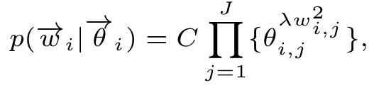
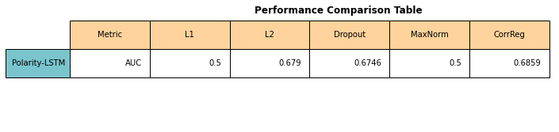

# **Adaptive Knowledge Driven Regularization for Deep Neural Networks**
This readme file is an outcome of the [CENG501 (Spring 2022)](https://ceng.metu.edu.tr/~skalkan/DL/) project for reproducing a paper without an implementation. See [CENG501 (Spring 2022) Project List](https://github.com/CENG501-Projects/CENG501-Spring2022) for a complete list of all paper reproduction projects.

# **1. Introduction**
In many real-world application, regularizing model training requires inductive bias and auxiliary knowledge due to limited amount of available data. However, the existing regularization methods fail to take the interaction between connected neuron pairs into account, which is invaluable internal knowledge for adaptive regularization.

In order to overcome this issue, Zhaojing Luo, Shaofeng Cai, Can Cui, Beng Chin Ooi and Yang Yang proposed "Adaptive Knowledge Driven Regularization for Deep Neural Networks" [1]. Their work was published in The Thirty-Fifth AAAI Conference on Artificial Intelligence (AAAI-21) proceeding in 2021.

Our goal in this repo is to implement the proposed "CORR-Reg" algorithm and reproduce the comparsions with the benchmark methods in the sense that we observe the same level of improvements with CORR-Reg.

## **1.1. Paper Summary**
In this paper, authors propose an adaptive internal knowledge driven regularization method, CORR-Reg, which explicitly takes into account the interaction between connected neurons.

The key idea of CORR-Reg is to give a higher significance weight to connections of more correlated neuron pairs. The significance weights adaptively identify more important input neurons for each neuron. Instead of regularizing connection model parameters with a static strength such as weight decay, CORR-Reg imposes weaker regularization strength on more significant connections. As a consequence, neurons attend to more informative input features and thus learn more diversified and discriminative representation.

Authors' contributions can be summarized as follows:
- They propose a general adaptive knowledge driven regularization method based on correlation to integrate internal knowledge into neural networks for a better representation learning.
- They design an efficient algorithm to update significance weights by applying the Lagrange multiplier method and update the model parameters via Stochastic Gradient Descent (SGD). The proposed algorithm effectively updates the two sets of parameters alternately.
- They conduct extensive experiments on real-world benchmark datasets and various neural network structures. Results show that the proposed CORR-Reg regularization
  achieves consistently better performance than state-of-the-art regularization methods.

# 2. **The Method and Our Interpretation**
## **2.1. The Original Method**
Authors propose to exploit correlation knowledge by integrating it into the model regularization during training based on the Bayesian inference framework.

### **2.1.1 Significance Weight**
To exploit the correlation as the internal knowledge to regularize training, they introduce a variable, *significance weight*, to the prior distribution of the model parameters.

The significance weight *θ<sub>i,j</sub>* between the *i*-th output neuron *O<sub>i</sub>* in the current layer and the *j*-th input neuron *I<sub>j</sub>* in the preceding layer represents the importance of *I<sub>j</sub>* to *O<sub>i</sub>* . During the model training process, each output neuron *O<sub>i</sub>* extracts higher-level representations from the *J* input neurons. Significance weights correspond naturally to the parameters of Multinomial distribution.

### **2.1.2 Correlation Regularization Term**
#### **2.1.2.1 Prior Distribution for Model parameters**
The prior distribution is designed to capture the relation between neurons from adjacent layers via the significance weight. Given the significance weight *θ<sub>i,j</sub>* and the model parameter *w<sub>i,j</sub>* that connects the output neuron *O<sub>i</sub>* with the input neuron *I<sub>j</sub>* , the generation probability of model parameters are defined as follows:

<center></center>

,where *C* is the normalization coefficient, and *λ* is the hyperparameter that controls the regularization strength of model parameter *w<sub>i,j</sub>* .

<center></center>

To incorporate correlation for learning *θ<sub>i,j</sub>* , Dirichlet distribution, which is the conjugate prior for *θ<sub>i,j</sub>* is employed with the joint distribution which can be formulated as *Eq.2* .

The hyperparameter *α<sub>i</sub>* is designed to integrate the correlation knowledge via *Eq.3*, where *β* is used to trade off between correlation and model parameters.

#### **2.1.2.2 Calculation of Correlation**
For *r<sub>i</sub>* of neuron *O<sub>i</sub>* , each dimension is a normalized correlation value, and each *r<sub>i, m</sub>* is calculated by:

<center></center>

,where *corr<sub>i, j</sub>* is the *Pearson correlation* value between *O<sub>i</sub>* and *I<sub>j</sub>* . In CORR-Reg, correlation is calculated batch-wise.

*N* denoting the batch size, for each mini-batch, there are *N* pairs of activation values for neurons *O<sub>i</sub>* and *I<sub>j</sub>* . Thus, the correlation between *O<sub>i</sub>* and *I<sub>j</sub>* can be calculated using the *N* pairs of activation values. However, since calculating the correlation batch-wise is not stable, authors propose to use the exponential moving average:

*corr<sub>i, j</sub>* = *γcorr<sub>i, j</sub>* + (1 - *γ*)*corr_curr<sub>i, j</sub>* , where *corr_curr<sub>i, j</sub>* is the correlation value calculated by using the
current mini-batch. *corr<sub>i, j</sub>* is initialized to zero and accumulates the correlation values calculated from each mini-batch. Empirically, *γ* is set to a large value, e.g., 0.9, so that *corr<sub>i, j</sub>* is less sensitive to recent changes and returns relatively stable values.


#### **2.1.2.3 Overall Loss Function**
Deriving the loss function from the maximum a posteriori (MAP) estimation over model parameters *w* :
<center></center>

,where *I* is the number of all output neurons. For the loss equation, the first term is the negative log-likelihood function, and the second term is the correlation regularization term.

### **2.1.3 Optimization for CORR-Reg**
In CORR-Reg method, both model parameters *w* and significance weights *θ<sub>i</sub>* of *O<sub>i</sub>* need to be updated. Both of them are updated jointly from the joint distribution defined in the loss function.

For model parameters, SGD is used as the update method, which is a conventional method for updating parameters of different models. For significance weights, since the condition that their summation must be equal to 1, Lagrange multiplier
method is adopted.

### **2.1.4 Lazy Update for CORR-Reg**
The update of significance weights is time-consuming because it involves calculation of correlation values. In order to reduce the overall computational costs, authors devise a lazy update algorithm.

The key idea is that both correlation values and significance weights do not change too much after the first few epochs. As a result, they do not need to be calculated every epoch after the first few epochs. *Algorithm 1* shows the overall procedure for updating model parameters and significance weights with lazy update:

<center></center>

*A* denotes the Dirichlet hyperparameters for all the hidden neurons, which is related to the correlation knowledge. *Θ* denotes the significance weights for all hidden neurons and is uniformly initialized. *lr* is the learning rate for SGD. *E* is the number of the first few epochs without lazy update, and *B* is the number of mini-batches in the training dataset. *T<sub>s</sub>* is the update interval for updating significance weights and it trades off between computational time and model performance.


## **2.2. Our Interpretation**
### **CORR-Reg**
The details of the implementation are clearly explained. However, authors did not share the exact values they used for some hyperparameters.

We are confused about getting activation value of layers to calculate significance weights. 
We use to 'register_forward_hook' method to get the activation values but there may be more efficient ways to get the values.

In fact, the computational cost was another difficulty that came to us. Training speed slows down as matrix calculations such as correlation and significance weight calculation are required.
The time complexity of our first implementation version is O(n^3) and the training process is much slower than the others. We were able to increase our speed by using different libraries (numpy, scipy). 
However, it still works slower than L2 and L1 regularization methods.
Actually, this is an expected result. Paper reduced the matrix update time to solve the computational cost problem.

Another issue encountered during the application is the calculation of the correlation between the activation values that are larger than two dimensions.
For example, the output of correlation between two 3-dimensional activation values,  is also three-dimensional. 
On the other hand, the dimension of the parameter weight between the layers is 2-dimensional. This has led to the size inconsistency. 
To get ahead of this, we reduced them to 2 dimensions by averaging the activation values that are more than 2 dimension.

In the data sets used, it was not specified whether any preprocessing done. 
For example, in the sentence polarity dataset, we went through different processes to create the dataset and generate our own vocabulary set.
In networks where we use Sentence Polarity, we preferred the pytorch embedding layer as the input layer. However, paper doesn't mention it.

In our implementation, significance weights for all hidden neurons are uniformly initialized and correlation values for all hidden neurons are initialized to 0.
After initialization, the correlation vectors are calculated as in Equation 4. Firstly, the Pearson Correlation value is calculated, and then it is normalized. (Calculation of Correlation part in the paper).

The significance weight is updated depending on the epoch number.(Lazy Update Procedure). The weight update is done as shown in equation 8 on the paper.

Finally, based on the significance weights, the regularizer loss is calculated. Paper explains not only overall loss function but also gradient descent of the loss function. 
In our implementation, we try to calculate overall loss function according to Equation 5. The
second term in the Equation 5 is the correlation regularization term.
We have calculated our regularization value as shown in this term. After calculating overall loss terms, the optimizer step is used to update weights.

### **Differences in Experiment Results**
As we mentioned in the Introduction, our main goal in this work was to observe an improvement with CORR-Reg compared to the benchmark methods, rather than reproducing the exact numerical results. However, we want to note our interpretations on the reasons why we got different numerical results during our experitments.

One reason for this case might be the framework used for implementing the models. Authors do not share the libraries or the frameworks they used for the implementation. In our implementations, we used PyTorch [3] framework.

The second reason could be the lack of information about some benchmark regularization implementations' hyperparameters. Although authors report the details of the benchmark models, momentum for SGD and the batch size, they do not give any information regarding the regularization coefficients for L1, L2 and Max-Norm, learning rates and how they implemented Dropout to the models. We share the details about our choices in Section 3.

Due to our limitations on computational resources, we were unable to train models for hundreds of epochs. However, we managed to observe the improvements of CORR-Reg regardless.

### **Computational Resource Limitations**
Due to our limitations on accessing high performance resources, we could train our models for less epochs. 


### **Datasets**
Three different datasets are used in training. Among the three datasets, MNIST and CIFAR-10 are public benchmark image datasets.
MNIST dataset contains handwritten digits which consists of 28 × 28 images in 10 classes. CIFAR-10 is an image  classification dataset which consists of 32 × 32 images in 10 classes.
On the other hand, Sentence Polarity dataset, which consists positive and negative processed sentences, is used to natural language processing applications.
During our experiments, we could not access MIMIC-III Dataset, which includes various types of medical features of the patients as it required an organization affiliation with Massachusetts Institute of Technology (MIT).


# **3. Experiments and Results**

## **3.1. Experimental Setup**

We implemented the benchmark models as described in the paper.

In the original paper, training epochs 500 for MLP and LSTM, 200 for autoencoder and LeNet, and 300 for VGG were adopted, but due to the afore-mentioned limitations, we could train for smaller epochs.

In addition, we interpreted dropout implementations, learning rate and regularization coefficients as there were no information in the paper.

For learning rate, we tried to choose our values by taking the batch size into consideration [2].

We tried to choose not only dropout insertion place but also dropout probability. These choices varied from model to model. Overall, we selected choices where the model would perform best. We finalized designing the layers by trying different layers and probabilities.

Moreover, the dataset that is used in metrics calculation is not specified. Therefore, we chose the test dataset to calculate metrics result.
Our hyperparameters for all models are as follows:

| Parameter           | Value |
|---------------------|-------|
| Batch Size          | 128   |
| SGD Momentum        | 0.9   |


<hr/>

| Parameter           | Sentence-Polarity-LSTM            | Sentence-Polarity-MLP | MNIST-MLP         | MNIST-AE          | MNIST-LeNet5      | CIFAR10-VGG16     |
|---------------------|-----------------------------------|-----------------------|-------------------|-------------------|-------------------|-------------------|
| Epochs              | 20                                | 50                    | 12                | 20                | 2                 | 4                 |
| Learning Rate       | 0.1                               | 0.1                   | 0.005             | 0.1               | 0.001             | 0.01              |
| L1,L2 Coefficient   | 5e-4                              | 0.001                 | 1e-4              | 1e-4              | 1e-6              | 1e-4              |
| Corr-Reg Lambda     | 5e-4                              | 0.001                 | 1e-4              | 1e-4              | 1e-6              | 1e-4              |
| Corr-Reg Beta       | 1e-7                              | 1e-6                  | 1e-6              | 1e-6              | 1e-6              | 1e-6              |
| Model Specific      | # of Layers = 2 Hidden Size = 128 | Hidden Size = 128     | Hidden Size = 128 | Image Resize = 28 | Image Resize = 32 | Image Resize = 32 |
| Dropout Probability | 0.75                              | 0.6                   | 0.6               | 0.6               | 0.6               | 0.6               |
| Max-Norm Max Value  | 2                                 | 1                     | 1                 | 1                 | 1                 | 1                 |

## **3.2. Running The Code**
The Project Scheme

```
project
│─── images (contains readme images)
│ 
│ 
│─── library/
│       │─── data_structure.py 
│       │─── dataset.py 
│       │─── loss.py 
│       │─── models.py 
│       │─── regularizer.py 
│       │─── util.py 
│ 
│ 
│─── metrics/
│       │─── metric.py 
│ 
│ 
│─── main.ipynb 
│ 
│─── README.md
│ 
│─── requirements.txt
```

Please use the .sh file which specified as below to download Sentence Polarity dataset. (If Dataset\rt-polarity.neg and Dataset\rt-polarity.pos files not exist)
```
./download_data.sh
```

The required Python modules are in requirements.txt. Please use the command below to install requirements.
```
pip3 install -r requirements.txt
```
[dataset.py](library/dataset.py) contains MNIST,CIFAR10 and Polarity dataset classes.\
[data_structure.py](library/data_structure.py) contains common Enum classes that were used in other files. \
[loss.py](library/loss.py) contains MSE, NLL loss functions. \
[models.py](library/models.py) contains LSTM, MLP, Autoencoder, LeNet, VGG classes. \
[regularizer.py](library/regularizer.py) contains our CorrReg Implementation. \
[util.py](library/util.py) contains preprocessing functions for Polarity Dataset. \
[metric.py](metrics/metric.py) contains metric class that is used to calculate Error Rate, MSE and AUC. \
[main.ipynb](main.ipynb) contains Introduction and Experiments sections

For training the models, comparing the regularization methods and visualizing the figures&tables, 
notebook(main.ipynb) file can be followed. 

The notebook file main parts are described as below.
* Introduction : Contains the hyperparams, device and the helper functions
* Datasets : Loading MNIST, CIFAR10, Sentence Polarity Datasets
* Model Initialization : Contains model initialization function
* Training&Testing : Contains training loop functions
* Experiments : All Models training sections are available.


## **3.3. Results**

### **Experiment 1**
Reproduction of Table 1 from original paper.

<hr/>
<center><b>Table 1.</b> Ratio of pairs of neurons with t-values exceeding the critical values. </center>
<hr/>
<center></center>
<center></center>


### **Experiment 2**
Reproduction of Tables 2 and 3 from original paper.
For both error rate and reconstruction error, smaller values indicate better performance. On the other hand, larger AUC(Area Under the ROC Curve) values indicate better performance.
<hr/>
<center><b>Table 2.</b> Performance comparison on benchmark image datasets. </center>
<hr/>
<center></center>
<center></center>
<center></center>
<center></center>

<hr/>
<center><b>Table 3.</b> Performance comparison on real-world applications. </center>
<hr/>
<center></center>
<center></center>

### **Experiment 3**
Reproduction of Figure 2 and Table 4 from original paper. Since we could not access MIMIC-III dataset, we used MNIST for MLP.


<div class="Figure1">
    <div class="imgContainer", style="float:left">
        
    </div>
    <div class="imgContainer", style="float:left">
        
    </div>
</div>
<center><b>Figure 1.</b> The distribution of VPR for bottom and top model
parameters in MNIST-AE-7 and MIMIC-III-MLP-0.</center>


<hr/>
<center><b>Table 4.</b> Average VPR for bottom and top model parameters.</center>
<hr/>
<center></center>
<center></center>

### **Experiment 4**
Reproduction of Figure 3 from original paper. Due to computational limitations, AE is skipped. 
Since we could not access MIMIC-III dataset, we used Sentence-Polarity for MLP and LSTM. 
Labels represent the Beta hyperparameters while x axis represent the Lambda values.
<center></center>
<center></center>
<center><b>Figure 2.</b> Performance for different λ and β values.</center>


# **4. Conclusion**
In experiment 1, we see high results for the *t*-test as in the original paper. Looking at Table 1, we can observe that correlation values of most pairs of neurons are not zero mean noises and the ratio is stable throughout the training. This result reproduces the authors' conclusion in which their assumption that correlation values between neurons exist and are stable. This means that such internal knowledge can be exploited to regularize.

In experiment 2, we compared Corr-Reg with the benchmark models and regularization methods. In original paper, even though some were little, Corr-Reg showed an improvement. Looking at Table 2. we can see that Corr-Reg performs slightly worse or the same as the benchmark. However, the differences are quite small and we can conclude that Corr-Reg performs on par with the benchmark.

In addition, one should note our computational limitations and the interpretations we had to make due to lack of information as we mentioned earlier. Looking at Table 3. though, even with less epochs, Corr-Reg outperforms the benchmark with higher ratios than the original paper. Therefore, we can conclude that Corr-Reg definitely is an improvement on the benchmark regularization methods.

In experiment 3, by looking at Figure 1, we can see that the percentage of model parameters decreases quickly as VPR increases. As stated in the original paper, this is expected since for the bottom model parameters, their corresponding correlation values are smaller and thus they are imposed stronger regularization. As a consequence, most of the bottom model parameters have small VPR. The distribution of top model parameters shows a reversed trend, and the explanation is the opposite. To further verify the effects of the correlation-based regularization, we can observe Table 4, the average VPR for bottom and top model parameters. The key observation is that we get large Avg VPR Dist of CORR-Reg values. This can be attributed to the fact that with CORR-Reg, bottom model parameters receive stronger regularization ,whereas top model parameters receive weaker regularization, which further confirms that the correlation knowledge is exploited to impose customized regularization on model parameters.

In experiment 4, we tried to investigate the effect of λ and β on the model training. Although we got different numbers, the changes in performance for the different hyperparameter values seem to show a similar trend for MLP. The reason behind the differences between the numerical values could be the dataset we used and/or our interpretations for some model hyperparameters


# **5. References**

[1] [Luo, Z., Cai, S., Cui, C., Ooi, B.C. and Yang, Y. 2021. Adaptive Knowledge Driven Regularization for Deep Neural Networks. Proceedings of the AAAI Conference on Artificial Intelligence. 35, 10 (May 2021), 8810-8818.](https://ojs.aaai.org/index.php/AAAI/article/view/17067)

[2] [Visualizing Learning rate vs Batch size](https://miguel-data-sc.github.io/2017-11-05-first/)

[3] [PyTorch - An open source machine learning framework that accelerates the path from research prototyping to production deployment.](https://pytorch.org/)

## **Code References**
This section contains the codes we used or inspired from during our implementations:
- L1 and L2 Regularizations in PyTorch: https://github.com/christianversloot/machine-learning-articles/blob/main/how-to-use-l1-l2-and-elastic-net-regularization-with-pytorch.md
- Max-Norm in PyTorch: https://github.com/kevinzakka/pytorch-goodies
- Autoencoder in PyTorch: https://www.geeksforgeeks.org/implementing-an-autoencoder-in-pytorch/
- LeNet5 PyTorch: https://towardsdatascience.com/implementing-yann-lecuns-lenet-5-in-pytorch-5e05a0911320
- VGG-16 with CIFAR-10 PyTorch: https://medium.com/@buiminhhien2k/solving-cifar10-dataset-with-vgg16-pre-trained-architect-using-pytorch-validation-accuracy-over-3f9596942861
- Preprocess the sentences: https://github.com/yoonkim/CNN_sentence/blob/master/process_data.py

# **Contact**
- **Ali Ibrahim Ozkan:** ozkan.ibrahim [at] metu.edu.tr
- **Mert Atay:** mert.atay [at] metu.edu.tr
