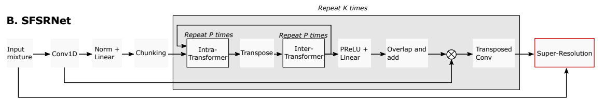
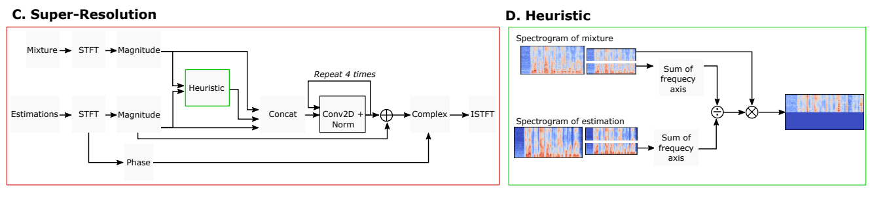
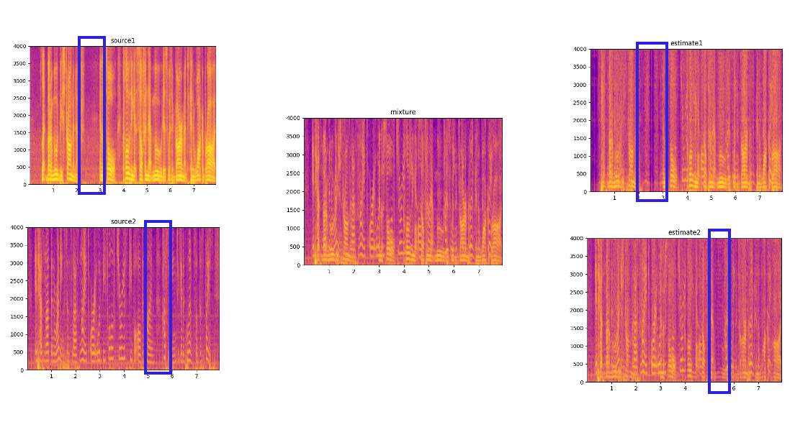
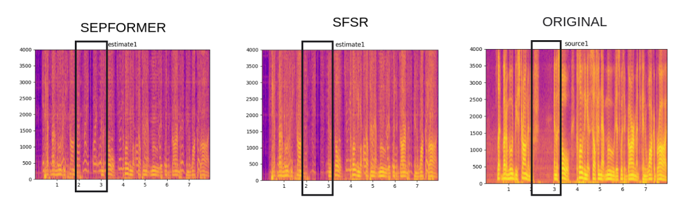
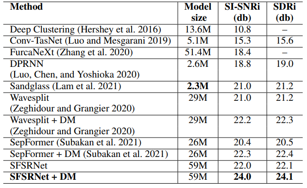

# SFSRNet: Super-resolution for single-channel Audio Source Separation

This readme file is an outcome of the [CENG501 (Spring 2022)](https://ceng.metu.edu.tr/~skalkan/DL/) project for reproducing a paper without an implementation. See [CENG501 (Spring 2022) Project List](https://github.com/CENG501-Projects/CENG501-Spring2022) for a complete list of all paper reproduction projects.

# 1. Introduction

Paper is published at Association for the Advancement of Artificial Intelligence(AAAI2022).
Check the paper <a href="https://www.aaai.org/AAAI22Papers/AAAI-1535.RixenJ.pdf">link</a>.
Single channel audio source separation aims to recover multiple audio sources that are mixed. This problem is essentially solved by methods by utilizing downsampling. However, due to the nature of downsampling, there will always be an information loss in the feed-forward of networks. In this paper, this problem is attempted to be solved by improving an already existing dual-path model Sepformer (Subakan. et al). We aim to reconstruct SFSR model introduced in this paper.

***Special thanks to @Joel Rixen who is one the authors of the paper for his quick and explanatory answers about the paper.***


## 1.1. Paper summary


The model, SFSRNet, introduced in the paper tries to enhance the performance of single channel audio source separation which simply means we have inputs having 2 or more people speaking, and we try to separate each of the speakers. In this purpose, SFSRNet changes the implementation of an already existing model SepFormer (Subakan. et al), and adds a new and separate network system called SuperResolution on top of it. SuperResolution aims to compensate downsampling related information losses of the problem.

# 2. The method and our interpretation

## 2.1. The original method

SFSRNet advances the Sepformer model (Subakan. et al) such that it aims to solve the downsampling problem and information loss. The key differences between SFSRNet and Sepformer are:
- Super Resolution block at the end of the Sepformer Model.
- Multi Loss implementation & separation block does not happen once but k times.
- Convolutional layer instead of linear layer in intra and inter transformers.



Super Resolution Block
- Super Resolution(SR) block itself is a model that can be trained just like Sepformer. However, the main goal of SR is to compensate for the information loss at Sepformer block. For this, it takes both original mixture and estimations of Sepformer as an input. First, Heuristics are used to correct the magnitude of the higher frequencies. Secondly, it gives estimations, mixture and corrected magnitudes to the SR Network to generate the final predictions. 

Multi Loss Implementation
- Contrary to the original Sepformer implementation, SFSRNet makes use of multi-loss application. For that purpose, instead of operating separation block k times, separation block + decoder block operates k times. Therefore, we go through the process of calculating estimations as many times as there are blocks and calculate the SI-SNR between each of these estimations and the sources. At the end, we use the sum of these losses (together with the superres loss) and use this as the final loss which the model is optimized for.



## 2.2. Our interpretation 

In multi-loss implementation, the first six sources are downsampled with specific Hz’s such that first 6 blocks to 500 Hz, 1 kHz, 2 kHz, 3 kHz, 4 kHz and 5 kHz, respectively. The remaining estimations use the original 8 kHz sources. 
In our implementation, we downsampled the sources; however, we could not match the dimensions with predictions for loss calculation. Therefore, we also downsampled the predictions in the same way to fix the error. 

Other than that, thanks to @Joel Rixen who is one the authors of the paper all our questions were answered clearly.  

# 3. Experiments and results

## 3.1. Experimental setup

The Setup of the Original Paper:

In the SepFormer part, encoder has a filter size of 256, a kernel size of 16 and a stride factor of 8. The chunk size is 50 with an overlap of 50%. They use K = 8 SepFormer blocks with P = 2 Intra- and InterTransformers each. The kernel size of the two dimensional convolutional layers of the Transformers is 3. The linear layer preceding the two dimensional convolutional layers has 512 hidden units. The MHAs use 8 parallel heads.For the SR, they use a frame length of 256 and a frame step of 64 for the STFTs. The convolutional layers have filter sizes of 128, 256, 128 and C, respectively. Their kernel sizes are 5, 9, 11 and 11, respectively. The training objective for both the separation and SR is
scale-invariant signal-to-noise-ratio (SI-SNR) (Roux et al. 2018). Since 8 SepFormer blocks are used, there are 8 estimations for which the losses are calculated for. The sources with which the estimations are compared to are downsampled for the first 6 blocks to 500 Hz, 1 kHz, 2 kHz, 3 kHz, 4 kHz and 5 kHz, respectively. The remaining estimations use the original 8 kHz sources. After these 8 uPIT SI-SNRs
are calculated, the average of the 8 losses is calculated and added to the SR loss. 
For the optimization, the Adam optimizer (Kingma and Ba 2017) is utilized with a learning rate of 15e-5 . After the first 50 epochs, the learning rate is halved, once the performance on the validation dataset does not improve for 3 epochs. Gradient clipping is used with maximum L2-norm of 5. The network is trained for 100 epochs in total. They evaluated their system on the two-speaker speech separation problem using WSJ0-2mix dataset (Hershey et al. 2016) which is based on the WSJ0 corpus (Garofolo, John S. et al. 1993). This dataset contains 30 hours of training, 10 hours of validation data and 5 hours of evaluation data. Aside from the WSJ02-Mix, the clean and noisy Libri2Mix datasets (Cosentino et al. 2020) are also used to evaluate the SFSRNet. The Libri2Mix datasets are based on the LibriSpeech ASR corpus (Panayotov et al. 2015), and they are similar to WSJ0-2mix dataset. Similarly to the WSJ02-Mix, the Libri2Mix datasets take two utterances and mixes them together. In the noisy Libri2Mix dataset, background noise is added on top of the two utterances. The Libri2Mix datasets consist of 212 hours of training, 11 hours of validation and 11 hours of evaluation data.

Our Settings:

Our model setup is exactly the same with the original one except we could train our model for 15 epochs. The main reason behind this was computational resources and time related restrictions. We could use only Google Colab for our training, and even 15 epochs lasts 2.5 hours. Thus we could not train our model further.
Furthermore, WSJ0-2mix dataset is unfortunately not a free dataset, and we couldn’t afford it. We could access to Libri2Mix dataset. However, we couldn’t use the entire dataset since it is ~500 GB. Instead, we used MiniLibriMix dataset which is relatively small version of Libri2Mix. It contains a train set of 800 mixtures and a validation set of 200 mixtures.


## 3.2. Running the code

We preferred Google Colab as our working platform, and suggest anybody who wants to run our code. 

Directory Structure:
```ruby

├── checkpoint
├── config
│   ├── test
│   │   ├── evaluate.json5
│   │   └── separate.json5
│   └── train
│       └── train.json5
├── dataset
│   ├── data_loader.py
│   ├── data.py
│   └── preprocess.py
│   ├── cv
│   │   ├── mix.json
│   │   ├── s1.json
│   │   └── s2.json
│   ├── tr
│   │   ├── mix.json
│   │   ├── s1.json
│   │   └── s2.json
│   └── tt
│       ├── mix.json
│       ├── s1.json
│       └── s2.json
├── logs
├── min
│   ├── cv
│   │   ├── mix
│   │   ├── s1
│   │   └── s2
│   ├── tr
│   │   ├── mix
│   │   ├── s1
│   │   └── s2
│   └── tt
│       ├── mix
│       ├── s1
│       └── s2
├── model
│   ├── sepformer.py
│   ├── SFSR.py
│   └── SuperResolution.py
├── src
│   ├── pit_criterion.py
│   ├── trainer.py
│   └── utils.py
├── json
└── train.py
├── evaluate.py


```

checkpoint Folder: In training for each epoch, related models are saved to this folder. Moreover, for the evaluation part, validation loss is compared, and the best model is saved in training for each epoch for further usage.

config Folder: Simply includes all of the configurations consisting of the parameters, working paths etc. for training and evaluation of the model. 

dataset Folder: It contains data preprocessing related python files, and tr, cv and tt folders including json files which consist of paths of the training, validation and test datasets respectively.

min Folder: It contains the dataset.

model Folder: It contains SepFormer, SuperResolution and SFSR models. SFSR model is simply the resulting model which includes SepFormer and SuperResolution models. SepFormer model is implemented in such a way that by making changes according to our paper. SuperResolution model is implemented from scratch according to the explanation in the paper.

src Folder: It contains helper functions related to training, evaluation and loss calculations.

json Folder: It contains the path of each input file for training, validation and test datasets.

evaluate.py: It is implemented to produce SI-SNRi and SDRi values for the best model.

train.py: It is implemented to train the model.

How to Run Our Code?

	1- Download this repository.
	3- Upload the .zip file that you downloaded from this repo to your Google Drive.
	4- Download the “SFSRNet.ipynb” file from this repository.
	5- Upload it to the same folder that you have uploaded the .zip file.
	6- Open “SFSRNet.ipynb” in Google Colab, and adjust related paths in “SFSRNet.ipynb”. If you do not want to not change paths you can edit your directory structure as in “SFSRNet.ipynb”. 
	7- Run the cells.

Important Note: To be able to train the model, GPU must be accessible and activated.

One can, surely, run our model easily in other platforms or his/her local computer by making necessary path changes in “SFSRNet.ipynb” and in some other files.

## 3.3. Results

We trained both the SFSRNet and the SepFormer with the experimental setup mentioned above to be able to analyze the success of our implementation. Each experiment ipynb file can be found in experiments folder.

Here is an example spectogram that shows the feed-forward of our model.



```ruby
We get 

	Average SDR improvement: 2.06

	Average SI_SNR improvement: 1.43 from our training in SFSRNet.
```

```ruby
We  get 

	Average SDR improvement: 1.67

	Average SI_SNR improvement: 1.28 from our training in SepFormer.
```

This difference could clearly be seen from the spectrograms of the sources and estimations.



Results are not exactly the same with the paper, but we can see performance increase with SFSRNet. This is normal since we could use a very small dataset compared to the original paper, and small epoch number because of time and computational resources related reasons. Yet, we get some improvements as can be seen above.

Results and epoch values can be seen in SFSRNet.ipynb and SepFormer.ipynb in the repository.

# 4. Conclusion

SFSRNet shows state-of-result performance when compared to other models in the literature for the given task as can be seen below. Especially with the help of the new mechanism SuperResolution, they claim that this approach can be expanded to most of the models. However, we can see that SFSRNet has more than two times bigger size than SepFormer as can be seen below. This might be the one of the downsides of SFSRNet. We also encountered this situation. Due to the model size our training time of the model significantly increased when compared to the training time of SepFormer even though our dataset and epoch count were smaller than the original scenario.




# 5. References

Renz, M., & Rixen, J. (2022). SFSRNet: Super-resolution for single-channel Audio Source Separation. https://www.aaai.org/AAAI22Papers/AAAI-1535.RixenJ.pdf

Subakan, C.; Ravanelli, M.; Cornell, S.; Bronzi, M.; and Zhong, J. 2021. Attention Is All You Need In Speech Separation. In ICASSP 2021 - 2021 IEEE International Conference on Acoustics, Speech and Signal Processing (ICASSP), 21–25. Toronto, ON, Canada: IEEE. https://arxiv.org/pdf/2010.13154.pdf

Zhongyang-debug. GitHub. Attention-Is-All-You-Need-In-Speech-Separation. https://github.com/Zhongyang-debug/Attention-Is-All-You-Need-In-Speech-Separation

kaituoxu. GitHub. Conv-TasNet. https://github.com/kaituoxu/Conv-TasNet


# Contact

For any further questions and suggestions, you can contact us at arda.numanoglu@metu.edu.tr [Arda Numanoğlu] and ates.suleyman@metu.edu.tr [Süleyman Ateş].
