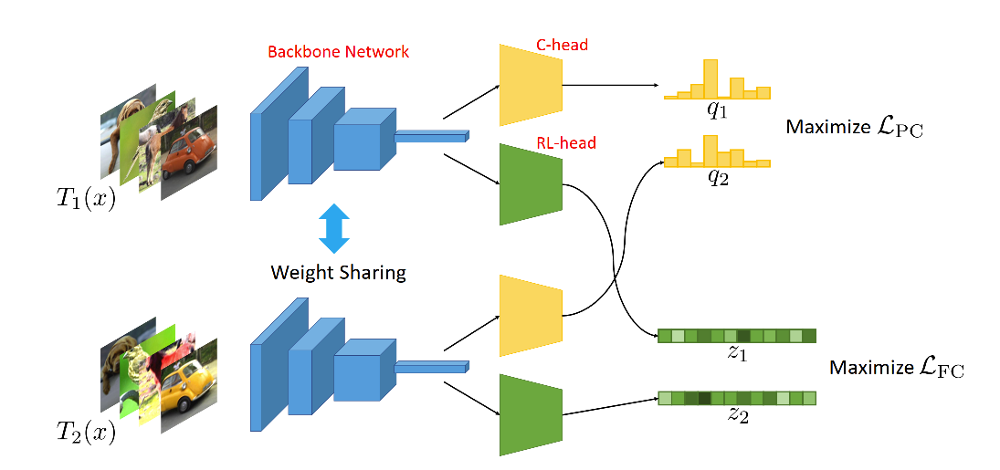

<!-- ## Clustering by Maximizing Mutual Information Across Views


A Pytorch implementation of [Clustering by Maximizing Mutual Information Across Views](https://arxiv.org/abs/2107.11635) paper from ICCV 2021

CRLC consists of two heads that share the same backbone network - a “representation learning” head and a
“clustering” head. The “representation learning” head captures fine-grained patterns of objects at the instance
level which serve as clues for the “clustering” head to extract coarse-grain information that separates objects into
clusters. The whole model is trained in an end-to-end manner by minimizing the weighted sum of two sample
oriented contrastive losses applied to the outputs of the two heads.

## Environment
TODO

## Usage
TODO

## Results


### CIFAR - 10
|  Method  |    ACC   |    NMI   |   ARI    |
|  :----:  |  :----:  |  :----:  |  :----:  |
| CRLC (paper) | 79.9 | 67.9 | 63.4 |
| CRLC (**Ours**) | - | - | - |

## Citation
```bibtex
@inproceedings{do2021clustering,
  title={Clustering by maximizing mutual information across views},
  author={Do, Kien and Tran, Truyen and Venkatesh, Svetha},
  booktitle={Proceedings of the IEEE/CVF International Conference on Computer Vision},
  pages={9928--9938},
  year={2021}
}
``` -->


# Clustering by Maximizing Mutual Information Across Views

This readme file is an outcome of the [CENG501 (Spring 2022)](https://ceng.metu.edu.tr/~skalkan/DL/) project for reproducing a paper without an implementation. See [CENG501 (Spring 2022) Project List](https://github.com/CENG501-Projects/CENG501-Spring2022) for a complete list of all paper reproduction projects.

# 1. Introduction

An unofficial Pytorch reproduction of [Clustering by Maximizing Mutual Information Across Views](https://arxiv.org/abs/2107.11635) paper from ICCV 2021.

## 1.1. Paper summary

CRLC is a framework for (unsupervised) image clustering that incorporates joint representation learning and clustering.
CRLC consists of two heads that share the same backbone network - a “representation learning” head and a
“clustering” head. Not only the joint learning of representation and clustering but also the introduction
of the contrastive loss for estimated probability distributions "log-of-dot-product" are the novelties of this paper.
<!-- @TODO: Summarize the paper, the method & its contributions in relation with the existing literature. -->

# 2. The method and my interpretation

## 2.1. The original method


CRLC consists of a “clustering” head and a “representation learning” head sharing the same backbone network. x denotes an
input images and T1(x), T2(x) denote two different transformations of x, similar to common contrastive learning
framework of SimCLR [[1]](#1). Representation and clustering heads are 2 layer MLP's giving the
(class agnostic) probability distribution and feature for each view. There are C number of clustering heads being trained independently.
There are two type of losses, namely FC (feature contrastive) loss and Cluster loss.

Feature contrastive is the contrastive loss of SimCLR, which is cross entropy of feature similarities where
transformed (1) view is considered as positive sample and other (2*(batch_size - 1)) batch views are considered as negative samples.

Cluster loss is comprised of two items, the first one is the PC (probability contrastive) loss and the second one is the entropy.
Similar to FC loss, PC loss is calculated by cross entropy of similarities. As a similarity function, instead of cosine similarity of features,
"log-of-dot-product" of class probability distributions is used. The additional entropy term is calculated on predicted probability
distributions and inversely added to loss. Main purpose of using negative entropy is making the predictions more similar to
uniform distribution and avoid degenerate solutions.

In evaluation, end-to-end clustering is applied. The main evaluation metric is classification accuracy.
After classes are predicted with trained clustering head,
Hungarian-Matching algorithm is applied to find matching classes with ground truth.


## 2.2. My interpretation

There are two points we could not figure out during our implementation:
- Inclusion of entropy term between different distributions to loss. It is not clear if
we should get entropy for each view of each head (meaning C.batch_size.2 distributions) independently or
Mean of distributions from 2 views of the same image (meaning C.batch_size distributions). We implemented
our code according to the first one.
- Handling of subheads during evaluation. After training C heads, it is not clear how they are used in evaluation.
Since each head has different and inconsistent class assignments, it is not possible to get the average probability
from all heads. We implemented the evaluation based on the outputs of the first head.

# 3. Experiments and results

## 3.1. Experimental setup
- In the paper, they used CIFAR-10, CIFAR-20, CIFAR-100, STL10 and ImageNet10 for end-to-end clustering.
We provided the code for only CIFAR-10, however it can be easily extended to provide other datasets.
- They used a SGD optimizer with a constant learning rate = 0.1, momentum = 0.9, Nesterov = False, weight decay = 5e-4, batch size = 512, epochs = 2000, lambda1 (entropy coefficient) = 1 and lambda2 (FCLoss coefficient) = 10. We followed their setup except lambda1, which is the entropy coefficient.

## 3.2. Running the code
We trained our model with Python X, PyTorch 1.10 and Cuda version 10.2 on a single P100 GPU.
To start a training with the hyper-parameters in the paper, given:
- `$DATA_PATH`, path to desired location to download (or located) dataset
- `$LOG_PATH`, path to desired location to locate log file of training
- `$SAVE_PATH`, path to desired location to save the model weights after each epoch
You can run the following directly:
```
python run.py \
--data_path ${DATA_PATH} \
--log_file_path ${LOG_PATH} \
--model_save_path ${SAVE_PATH}
```
Evaluation is applied in every 5 epochs of training.

## 3.3. Results

We evaluated our implementation with end-to-end clustering on CIFAR-10 with different lambda1 (entropy coefficients) values 0.1, 0.3 and 1.0 (default).

|  Method  |    ACC   |    NMI   |   ARI    |
|  :----:  |  :----:  |  :----:  |  :----:  |
| CRLC (paper, lambda1=1.0) | 79.9 | 67.9 | 63.4 |
| CRLC (**Ours**, lambda1=1.0) | 40.9 | 36.4 | 28.1 |
| CRLC (**Ours**, lambda1=0.3) | 48.1 | 36.0 | 27.5 |
| CRLC (**Ours**, lambda1=0.1) | 48.1 | 36.5 | 27.7 |

As we can see, we achieved better results with different entropy coefficients than the value given in the paper.


# 4. Conclusion
Main advantage of the paper is that it facilitates both representation learning and clustering with two different heads in the same network which makes it’s performance better than the previous works. However, it requires lots of training (~2000 epoch) and more time to converge and it uses the ResNet34 model unlike the other works which usually use ResNet18. So, it requires more memory because of the number of parameters. \
We could not reproduce the results in the paper although we followed each detail in the paper.
We tried to understand how entropy coefficient affect the result by
logging the probability predictions for a particular image. We think that we need to find
the optimal entropy coefficient and it is not the value given in the paper.

# 5. References

You can cite paper with:
```bibtex
@inproceedings{do2021clustering,
  title={Clustering by maximizing mutual information across views},
  author={Do, Kien and Tran, Truyen and Venkatesh, Svetha},
  booktitle={Proceedings of the IEEE/CVF International Conference on Computer Vision},
  pages={9928--9938},
  year={2021}
}
```

<a id="1">[1]</a>
Chen, T., Kornblith, S., Norouzi, M., & Hinton, G. (2020, November).
A simple framework for contrastive learning of visual representations.
In International conference on machine learning (pp. 1597-1607). PMLR.

# Contact
Görkay Aydemir: gorkaydemir1999@gmail.com \
Batuhan Bal: xcvbatuhanbal@gmail.com
