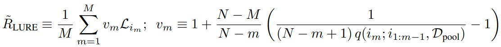

# On Statistical Bias in Active Learning: How and When to Fix It

This readme file is an outcome of the [CENG501 (Spring 2022)](https://ceng.metu.edu.tr/~skalkan/DL/) project for reproducing a paper without an implementation. See [CENG501 (Spring 2022) Project List](https://github.com/CENG501-Projects/CENG501-Spring2022) for a complete list of all paper reproduction projects.

# 1. Introduction

We are working on the paper named "[On Statistical Bias in Active Learning: How and When to Fix It](https://arxiv.org/abs/2101.11665)" from ICLR 2021, written by Sebastian Farquhar, Yarin Gal and Tom Rainforth. This paper discusses the advantages and disadvantages of the statistical bias in underparametrized and overparameterized algorithms due to the inability to maintain the original population distribution while applying pool-based active learning, and formulates two different risk estimators to eliminate this bias.

Our goal is to obtain results close to the results obtained in the paper by changing the experimental details specified to a minimum extent as required by the context of the course, our abilities and resources. Although linear regression is used to analyze underparametrized models in the paper, we will leave this analysis out due to the scope of the course and focus only on overparametrized neural networks.

## 1.1. Paper summary

Active learning is particularly important when dealing with real-world data where labeled data is scarce or it is expensive to label the data. In pool-based active learning, we train a training set consisting of a small number of instances and make predictions on unlabeled data, which we call the pool. We take the sample on which we are most unsure about the prediction, put it in the training set, and repeat this process iteratively until certain finishing conditions are met. (1)

Active learning aims to use the data in the most effective way to produce a model with acceptable performance over an actively sampled subset of the data with a small number of elements, but this subset used in training does not show the distribution of the population. This situation causes statistical bias in active learning. In this paper, two different unbiased risk estimators are formulated that should be minimized during training. Details on these formulas will be given in the next chapter.

Thanks to these risk estimators, an increase in performance was observed when we removed the bias that occurred while doing active learning in underparametrized models such as linear regression. This is explained by the fact that each learned example has a global effect on the model. However, when we look at overparameterized models such as Bayesian neural networks (BNNs), we observe a negative change when we remove the bias. In overparameterized models like neural networks, statistical bias provide a better generalization by showing regularization effect. The paper has empirically proven these judgments.

Although the paper states that there are some studies that consider statistical bias introduced by active learning before, it says that the complete problem has not been addressed and understood before.

# 2. The method and my interpretation

## 2.1. The original method

As we mentioned above, pool-based active learning distorts the original distribution of the data, as it only adds the most informative sample to the training set in each iteration, and therefore introduces a bias. To eliminate this bias, the paper proposes two unbiased risk estimators that calculate a weighted expectation value on each actively collected data sample. The formulation of the first of these, R_PURE, is as in Figure 1.

Figure 1: The formulation of R_PURE.

In the above formula, N indicates the total number of instances of the dataset, while M indicates the number of actively sampled instances. q(..) symbolizes the probability mass function, which shows the probability of each instance being the next chosen one and is different from 0 for each instance.

While R_PURE is an unbiased risk estimator, it depends the position of the actively sampled instance. For example, in a uniformly distributed dataset, an early sampled instance has higher weight than the later sampled instance. R_LURE solves this problem so that the estimated risk depends only on whether the instance is sampled or not. The formula of R_LURE is as in Figure 2.

Figure 2: The formulation of R_LURE.

## 2.2. My interpretation 

Although the paper explains in detail many stages of the experiment and specifies all the hyperparameters it uses on a table, we had to make some changes and assumptions while implementing the method in the scope of this course.

First, when applying pool-based active learning in the paper, the sample that the model is least sure about each time is included in the training set. This state of least certainty was determined by Farqhuar et al.'s proposed Radial BNN Variational Inference (2). While we found both original and non-original GitHub repositories written on / for that paper, we would have to do a lot of work on BNNs to integrate these functions, and we wanted to keep things simple as it might be beyond the scope of this project. We can also understand how confident a model is on a sample from the results of the softmax function in the output layer. The sample with the lowest highest value in the Softmax layer will be the least certain about its final prediction and can therefore be transferred from the pool set to the training set.

Moreover, most of the experiments in the paper were done on the unbalanced MNIST dataset with noise introduced. As this making unbalanced pre-process, noise was first added to the dataset and random labels were assigned to some samples. Then, the dataset was made unbalanced by taking samples from each class at different rates. However, since this could have a randomized effect, there were also findings on balanced MNIST, MNIST with Monte Carlo dropout, and even a brand new dataset, FashionMNIST, to disprove this randomized effect. We conducted our experiment on balanced MNIST, as we thought that comparison on a balanced, unprocessed MNIST dataset would be the most consistent method.

Finally, we have seen that even though a formula for the probability mass function is explicitly stated in the section about the experiment details, q(..) values can be easily calculated with the 1 / (N+m-1) formula in datasets with the uniform distribution. In the MNIST dataset, we can say that there is a uniform distribution because the sample numbers of the all classes are close to each other, and therefore we can easily use this formula.

# 3. Experiments and results

## 3.1. Experimental setup

For the experiment, we use the MNIST dataset, which is mainly used in the paper.

On paper, they use 1/4 of the MNIST dataset due to a better performance and ease of use. 1000 samples from this data are used as the validation set to use in early stopping mechanism. Among the remaining data, 10 samples are selected as the initial training set, while the remaining samples form the pool set. Since M (size of the training set) in all plots in the paper ends at 100 samples, we decided to continue our experiment until the training set consists of 100 samples. Since empirical risk was measured on the balanced MNIST dataset, we decided to build our plot on test loss values as well.

You can find the changes and assumptions we made due to the scope of the course and the project, our resources and capabilities in the chapter above. Apart from these changes, we applied all the hyperparameters specified in the paper in our experiment. The hyperparameters we use, which are the same in the paper, are as follows: 
- Conv1: 1-16 channels, 5x5 kernel, 2x2 maxpool
- Conv2: 16-32 channels, 5x5 kernel, 2x2 maxpool
- Fully connected 1: 128 hidden units
- Fully connected 2: 10 hidden units
- Loss function: Negative log likelihood
- Activation: ReLU
- Optimization Algorithm: Amsgrad
- Learning rate: 0.0005
- Batch size: 64
- Epochs: 100
- Early stopping: 20

## 3.2. Running the code

The experiment was performed on Google Colab in Jupyter Notebook format. Therefore, it is very easy to run the code. You can run each cell sequentially by uploading  the experiment.ipynb file to Google Colab without previously downloading any dependency or dataset.

## 3.3. Results

Unfortunately, we were not able to implement backpropagation in our R_PURE and R_LURE implementations, so it cannot be said that we have performed a training with these unbiased risk estimators. We obtained constant values in both R_PURE and R_LURE for all M values. Therefore, all we observed is that the empirical loss of the normal risk estimator decreases as M increases, which can be easily predicted. Also, it will be meaningless to put the plot here and compare it with the one in the paper; however, you can see the plot in the experiment.ipynb file.

# 4. Conclusion

As we mentioned above, bias introduced by active learning may have a negative effect in underparametrized models like linear regression, while may have regularization and thus generalization effect in overparametrized models such as neural networks. Although this bias can be eliminated with different risk estimators, namely R_PURE and R_LURE, we can choose not to eliminate this bias in deep neural networks.

# 5. References

[1] Burr Settles. Active Learning Literature Survey. Machine Learning, 15(2):201-221, 2010

[2] Sebastian Farquhar, Michael Osborne, and Yarin Gal. Radial Bayesian Neural Networks: Robust Variational Inference In Big Models. Proceedings of the 23rd International Conference on Artificial Intelligence and Statistics, 2020.

# Contact

Berke Ates Aytekin - atesaytekinn@gmail.com
Cenk Gurbet - cenkk370@gmail.com
