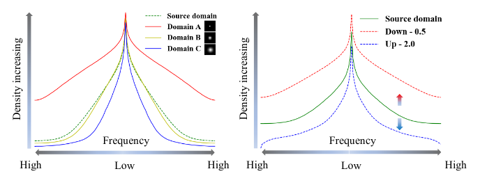
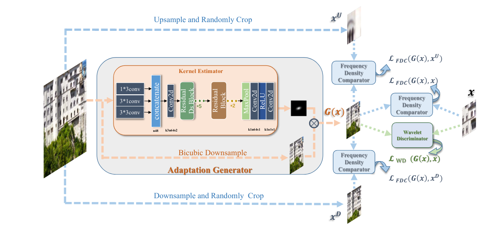
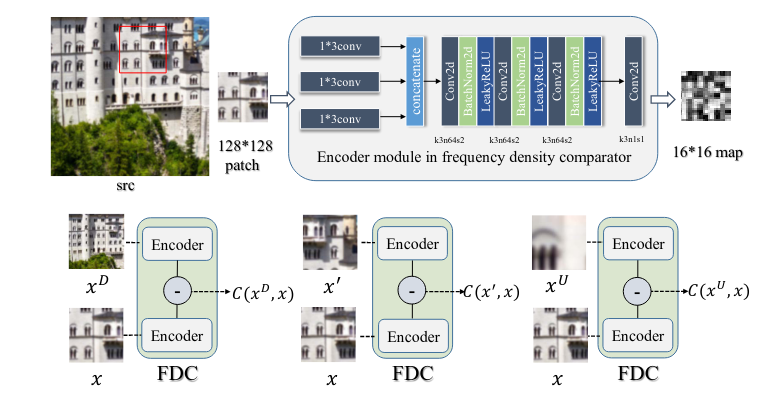
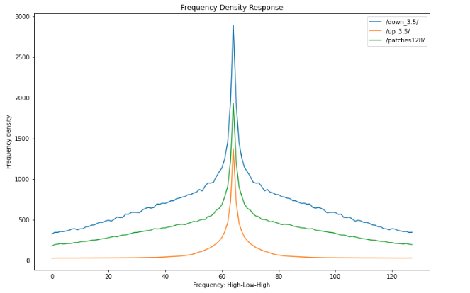
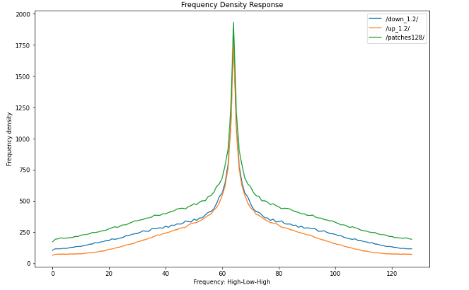
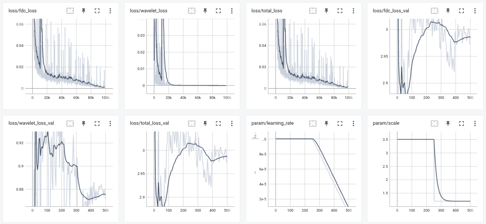
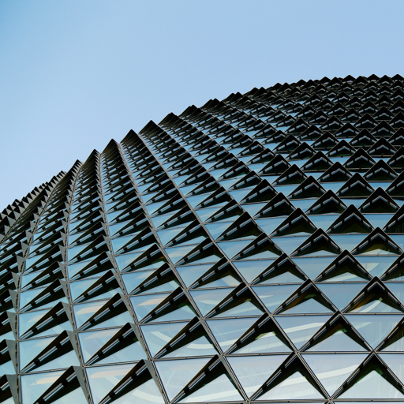
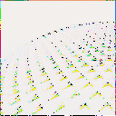

# Frequency Consistent Adaptation for Real World Super Resolution

This readme file is an outcome of the [CENG501 (Spring 2022)](https://ceng.metu.edu.tr/~skalkan/DL/) project for reproducing a paper without an implementation. See [CENG501 (Spring 2022) Project List](https://github.com/CENG501-Projects/CENG501-Spring2022) for a complete list of all paper reproduction projects.

# 1. Introduction

 
This is an unofficial implementation of the paper "Frequency Consistent Adaptation for Real World Super Resolution" from the AAAI-21. The primary goal is to generate high resolution (HR) and low resolution (LR) pairs in such a way that they have the same frequency density response. This ensures the generated images not to be too blurry (over-smoothed) or over-sharpened. In this paper, a smart downsampling strategy that learns a blur kernel to maintain the same frequency density response is proposed.

## 1.1. Paper summary

 
Super-resolution is enhancing the spatial resolution of a given image. Super-resolution networks are usually trained in a self-supervised manner in which low resolution (LR) images are generated from high resolution (HR) images by downsampling the HR image with a kernel (usually bicubic with anti-aliasing) then adding an additive gaussian noise. However, this degradation might not be ideal, and can perform poorly on real images. This situation stems from the domain gap between bicubically downsampled synthetic images and real images. 

$I_{LR}$ = ($I_{HR}$ $\otimes$ k) + n

Some researchers try to find the degradation kernel inside from the image (blind-SR)[1]. On the other hand, some researchers do not use kernels at all, and construct a new "real-world" dataset using cameras with different focal lengths [2]. Then, the network is trained in a supervised manner. Some other researches propose finding a kernel that minimizes the domain gap [3]. Domain translation methods are used here to map the bicubically downsampled images domain to the real images domain. GAN based methods are utilized here, but they are hard to train/converge. The winner of the AIM Challange on Real World SR at ICCV 2019 [4] proposes a method that uses adversarial loss only on the high-frequency data to speed-up convergence since low-frequency data can readily be obtained using the bicubically downsampled image. "Frequency Consistent Adaptation for Real World Super Resolution" paper is very close related to this paper. Here, authors also claim that downsampling using the bicubic kernel changes the frequency density distribution of the image as seen in Figure 1. To narrow the frequency density response gap between domains, they propose a frequency consistency loss. Using this loss alongside the wavelet loss (again only on high frequencies) they try to find a "frequency consistent" mapping between LR and HR images.

Figure 1. Frequency density effect of different operations.

# 2. The method and my interpretation

## 2.1. The original method

 

The main purpose is to find a blur kernel that maps the bicubically downsampled images to their frequency consistent versions. To achieve this, authors propose three main modules namely, Adaptation Generator, Frequency Density Comparor(FDC), and Wavelet Discriminator (WD) as seen in Figure 2. FDC, and WD modules are only used in the training phase to generate relevant losses. 

Figure 2. Frequency consistent adaptation model architecture.

Adaptation generator, bucibically downscales a given input image, and using the blur kernel maps it into the frequency consistent version. This blur kernel is calculated from the input image, using a sequence of inception blocks, residual Ds (will be discussed later) blocks, residual blocks, maxpool, and convolutions. Afterwards, the downsampled image is convolved with the kernel. 

FDC modules compares frequency densities of 128x128 patches of the LR image with 128x128 cropped patches of downsampled image, upsampled image, and another patch from the LR image. FDC modules has two encoders with shared weights weights, and gets two inputs. Frequency density loss is obtained after subtracting different inputs' encodings from each other. The encoder consists of parts in Fig 3. 

Figure 3. Frequency density comparator (FDC) architecture.

Wavelet Discriminator first filters the input with Haar wavelet transform, then high pass filtered parts are fed to the discriminator, which is inspired by the LS-GAN[5] with four layers, and generate the wavelet loss.

## 2.2. My interpretation 

 

There were several parts not explained in the paper. I have sent an email to the original authors, and still waiting for a response.
* Residual DS Blocks were not referenced nor explained in the text. I have assumed they were residual dense blocks from the "Residual Dense Network for Image Super-Resolution" paper.
* Kernel generated by the kernel estimator was supposed to be an anistropic gaussian blur kernel, but after training the end result was very different. In the paper, downsampling image was described as convolving with this kernel. However, they have the same size, their convolution would not generate an image with the same size as the downsampled image. Therefore, instead of convolution, I have implemented an element-wise multiplication here.
* Training parameters were not given. I have selected ADAM optimizer with $\beta_{1} = 0.5$, $\beta_{2} = 0.99$, learning rate = 0.0001, batch size=8, and used a learning rate scheduler which kept the learning rate constant until the half of the number of total epochs, then decreased it linearly. These parameters were choosen from the frequency separation[4] paper which was very similar to this paper in purpose.

# 3. Experiments and results

## 3.1. Experimental setup

 

In the original paper, 512x512 patches are given to the adaptation generator, downsampling factor is 4, curriculum learning with scales 3.5, and 1.2 is used. Loss weights for FDC, and WD are 1 and 0.001 respectively. Furthermore, input-output images are blurred with a 13x13 gaussian kernel with a variance of 9.

I have used the same settings, except I did not use blur kernels to see the upper-bound of the network, with images closer to the ideal.

## 3.2. Running the code

### Installation
 Install conda using https://docs.conda.io/projects/conda/en/latest/user-guide/install/linux.html

>  conda create --name adapt-gen python=3.9

> conda activate adapt-gen

Install pytorch from https://pytorch.org/

> conda install pytorch torchvision torchaudio cudatoolkit=11.6 -c pytorch -c conda-forge

Install other requirements
> pip install -r requirements.txt

Install pytorch_wavelets (for the wavelet filter in the wavelet discriminator)
> git clone https://github.com/fbcotter/pytorch_wavelets

> cd pytorch_wavelets

> pip install .

> pip install -r tests/requirements.txt

Test, ignore all warnings.
> pytest tests/

Return to the project folder
> cd ..

### Using the code
Dataset generation, this may take a while.

> python create_dataset.py [--args]

Train the network

> python train.py [--args] 

Use tensorboard to look at loss graphs

> tensorboard --logdir <tensorboard_path> 

Test

>python test.py --checkpoint <checkpoint_path> --input_data <input_folder> --output_data <output_folder>

Frequency density of images in any given folders can be compared using the "frequency_density.ipynb" notebook

## 3.3. Results

 
I have implemented a notebook file to measure the frequency density response of different setups. This provided a sanity check to see whether the assumption in Figure 1. was consistent with my implementation or not. Frequency density responses of inputs with scales 3.5 and 1.2 can be seen in Figure 4. and Figure 5. respectively. While the scale 3.5 fits into authors' assumption, scale 1.2 behaves differently. Therefore, loss calculations in the FDC might be wrong. Training and validation losses can be seen in Figure 6. While the training loss seems okay, the network performed very poorly on the validation set, FDC loss of the validation set only increased. The model was insufficient to generalize. Loss functions looks like an overfit. However, the model performed badly on the training set, too. Input, and output images of the trained model can be seen in Figure 7. and Figure 8. respectively.

Figure 4. Frequency density response of the training set, scaled with 3.5 and 1/3.5 

Figure 5. Frequency density response of the training set, scaled with 3.5, and 1/3.5

Figure 6. Losses and parameters of train and validation sets during training.

Figure 7. The input image with size 512x512.

Figure 8. The output image with size 128x128.

# 4. Conclusion

 

I could not reproduce the results. I think the main reason is not being able to find an anistropic gaussian kernel. I either missed a step while generating the kernel or the model diverged too much from the bicubic downsampling, which is very likely since the model lacks loss functions to keep the low frequency data like pixel loss (L1/L2), or any other mechanism that limits the kernel function.

# 5. References

 

[1] Sefi Bell-Kligler, Assaf Shocher, Michal Irani. Blind Super-Resolution Kernel Estimation using an Internal-GAN. NeurIPS, 2019. $\\$
[2] Xiaozhong Ji, Yun Cao, Ying Tai, Chengjie Wang, Jilin Li, and Feiyue Huang. Real-World Super-Resolution via Kernel Estimation and Noise Injection. CVPRW, 2020.$\\$
[3] Xiaozhong Ji, Guangpin Tao, Yun Cao, Ying Tai, Tong Lu, Chengjie Wang, Jilin Li, Feiyue Huang. Frequency Consistent Adaptation for Real World Super Resolution. AAAI, 2021.$\\$
[4] Manuel Fritsche, Shuhang Gu, Radu Timofte. Frequency Separation for Real-World Super-Resolution. ICCW, 2019.$\\$
[5] Xudong Mao, Qing Li, Haoran Xie, Raymond Y.K. Lau, Zhen Wang, and Stephen Paul Smolley. Least Squares Generative Adversarial Networks. ICCV, 2019

# Contact

Ali Baran Cengiz $\\$
Electrical and Electronics Engineering $\\$
Middle East Technical University $\\$
baran.cengiz@metu.edu.tr $\\$
