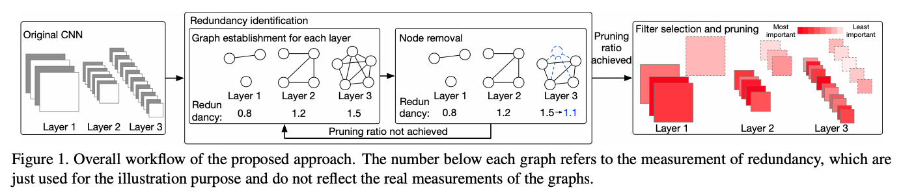
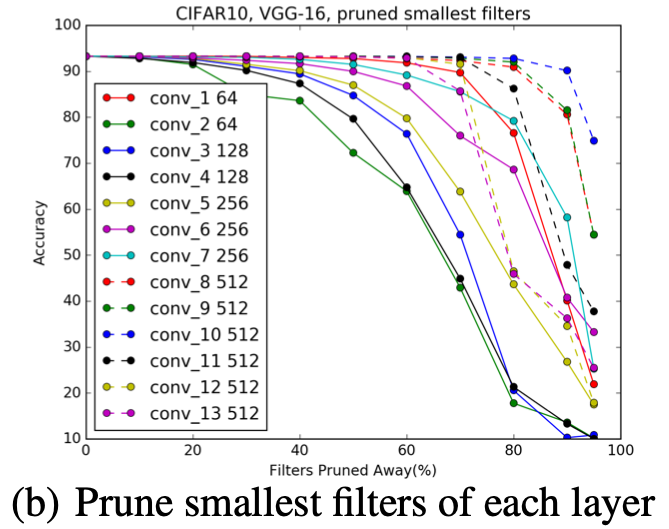

# Convolutional Neural Network Pruning with Structural Redundancy Reduction

This readme file is an outcome of the [CENG501 (Spring 2022)](https://ceng.metu.edu.tr/~skalkan/DL/) project for reproducing a paper without an implementation. See [CENG501 (Spring 2022) Project List](https://github.com/CENG501-Projects/CENG501-Spring2022) for a complete list of all paper reproduction projects.

# 1. Introduction
Our project paper, Convolutional Neural Network Pruning with Structural Redundancy Reduction by Wang et al., was accepted to CVPR 2021. In the paper, authors propose a filter pruning method, which highlights the importance of pruning filters from 'redundant' layers rather than pruning filters from the network as a whole. The main contribution of the paper is the method for computing structural redundancies of convolutional layers, where the proposed algorithm differs from and outperforms the state-of-the-art approaches [1-5]. As the dataset, the authors used CIFAR-10 and ImageNet ILSVRC-2012, with the well-known networks such as ResNet, AlexNet, or VGG16. Although the paper is reproducible as a whole, we aim to compare different prunning approaches on CIFAR-10 only, while using VGG16 as our network.

## 1.1. Paper summary

Compared to the existing works on network pruning that focus on removing the least important filters, Wang et al. proposed a method that prunes filters in the layers with the most structural redundancies [1-4]. To analyze structural redundancies of convolutional layers, authors represent each layer as a graph and use 1-covering-number along with the quotient space size. A graph with a higher 1-covering-number and larger quotient space size indicates less redundancy. After identifying the most redundant layer using the constructed graphs, the filters to be pruned are selected in that layer. Although there are different filter selection strategies [2], the authors used a simple strategy by pruning the filters with smaller absolute weights [1]. This pruning method resulted in 44.1% reduction in FLOPs while losing only 0.37% top-1 accuracy on ResNet50 with ImageNet ILSVRC-2012 dataset.

# 2. The method and my interpretation
## 2.1. The original method

Initially, authors start by representing each convolutional layer as a graph so that they can find the layer with the most structural redundancy. To construct the graph, weights are flattened and normalized to change their lengths to 1, so that each filter is a unit vector. The filters _(of an individual layer)_ form the vertices of the graph and if the Euclidean distance between any two filters is smaller than a threshold γ, an edge is formed between the two vertices to represent the similarity between kernels. This algorithm forms an undirected, unweighted graph which may or may not be connected.

The redundancy value of a layer is then computed by utilizing quotient space size, and 1-covering-number of the graph. Since computinng the ℓ-covering-number is NP-Hard, authors estimated 1-covering-number to achieve reasonable computation complexities. A weighted average of _estimated_ 1-covering-number and quotient space size is used, where the weights are also parameters but the authors observed no drastic impact of values, and eventually used 0.65 and 0.35 in the favor of 1-covering-number _estimation_.

_High ℓ-covering-number and large quotient space size indicates less redundancy, i.e. intuitively, the filters in the layer can be considered as linearly independent._

With the identification of the most structurally redundant layer, the next step is to find the filters to be pruned. Here, different metrics can be used, yet the authors used a simple method to prune the filters with smaller absolute weights. The reasoning is provided as a theoretical proof in the paper. In this proof, five different prunings schemes and resulting accuracies are compared. In a setting with two layers where η is a much more redundant layer than ξ;

- po denotes the accuracy with no pruning
- pηr denotes the accuracy with a random pruning from layer η
- pη' denotes the accuracy with pruning the least important filter from layer η
- pξ' denotes the accuracy with pruning the least important filter from layer ξ
- pg denotes the accuracy with pruning the least important overall filter

The relationship between these five accuracies are given as pξ' ≤ pg ≤ pηr ≤ pη' ≤ po. However, with large enough n, where n denotes the filter number of η, pηr ≈ pη' ≈ po. Thus, the authors avoided calculating the least important filter and preferred a method that might yield a result similar to pηr while improving the performance [1].

_Figure 1:_ The algorithm from Wang et al.

## 2.2. My interpretation 

The paper is well-written and there are not much problems with the explanations, however the filter selection is the most simplified aspect of the paper **apart from the missing Appendix**. Although the theoretical proof provides a good reasoning, the performance improvement by simplification of this part is still not clear. Also, there is no clear explanation of how many filters to prune at each iteration. Accordingly, we've decided to calculate the number of to-be-pruned filters based on the redundancy of a layer.

# 3. Experiments and results
## 3.1. Experimental setup

For our network, we preferred to use VGG16 instead of ResNet since adjusting residual connections after pruning might be complicated. With VGG16, a pruning on a convolutional layer only affects that layer and a single layer following it.

Since the [VGG16 model](https://pytorch.org/vision/main/models/generated/torchvision.models.vgg16.html) that Torch provides is pre-trained and uses an MLP head suitable for ImageNet dataset, we've decided to implement our own VGG16 that is suitable for CIFAR-10. We've then trained the network on CIFAR-10 for 50 epochs with:
- CrossEntropy loss
- SGD with momentum (=0.9)
- Batch size of 256, and learning rate of 1e-2

#### Note: The sole purpose of training the network without any pruning is to compare the performance after pruning it. We further want to clarify that we didn't have enough resources/time to tune the network to the optimum. With this settings, it provided 77.7% accuracy on the test set, which we took as a baseline performance result without any pruning.

We've implemented all the graph-related functions [here](https://github.com/CENG501-Projects/CENG501-Spring2022/blob/main/Project_Duymus_Guder/graph.py), including graph construction, computation of quotient space size, and estimation of 1-covering-number.

For the similarity threshold γ, we manually tested a few different values and decided to use 0.023, which is in range of the values used in the paper. We used same weights as the authors (0.65 for _estimated_ 1-covering-number and 0.35 for quotient space size). Redundancy score implementation is [here](https://github.com/CENG501-Projects/CENG501-Spring2022/blob/main/Project_Duymus_Guder/model.py). The model is [here](https://github.com/CENG501-Projects/CENG501-Spring2022/blob/main/Project_Duymus_Guder/model.py). The pruning code is [here](https://github.com/CENG501-Projects/CENG501-Spring2022/blob/main/Project_Duymus_Guder/prune.py) (note that it only works on VGG16).

After finding the most redundant layer, we used single-shot pruning as mentioned in the paper. Since the number of filters-to-be-pruned is not specified in the paper, we came up with our own formulation at this step. We've pruned $2 * \sqrt{r}$ filters, where $r$ denotes the redundancy of the layer. After each pruning step, we reconstructed the graph and calculated the redundancy only for the pruned layer, since the graph construction is the most costly part.

We've applied this pruning iteration 10-times, and had performance results after each pruning.

## 3.2. Running the code

To perform the training and generate a checkpoint with the experimented settings:

<code>python train.py</code>

To test the model on test set:

<code>python test.py</code>

To do the pruning iteratively and see performances on test set:

<code>python prune.py</code>

## 3.3. Results

Our results represent performances on CIFAR-10 test set **without any fine-tuning upon pruning**:

0. No pruning: **77.7% accuracy**
1. Pruning 45 filters from 28th layer: **77.65% accuracy**
2. Further pruning 45 filters from 26th layer: **77.62% accuracy**
3. Further pruning 45 filters from 24th layer: **77.50% accuracy**
4. Further pruning 45 filters from 21th layer: **77.63% accuracy**
5. Further pruning 45 filters from 19th layer: **77.57% accuracy**
6. Further pruning 43 filters from 28th layer: **77.46% accuracy**
7. Further pruning 43 filters from 26th layer: **77.27% accuracy**
8. Further pruning 43 filters from 24th layer: **77.13% accuracy**
9. Further pruning 43 filters from 21th layer: **77.11% accuracy**
10. Further pruning 43 filters from 19th layer: **77.08% accuracy**

Pruning of filters are performed accumulatively, e.g. step 3 is applied on top of step 2 and step 1.

# 4. Conclusion

Unfortunately the Appendix section of the paper is missing, where the authors of the paper have left most of the experiment settings, results etc. So, we cannot really compare the exact results, but the general patterns we've observed seem to match with the paper's, such as the redundant layers being later layers (See Figure 2) and that chopping off a network _generally_ yielding a performance loss.

The most obvious observation is that although we've pruned more than 10% (440/4224) of the filters, the performance loss was negligible **even without fine-tuning,** proving the sucess of the proposed method.

_Figure 2:_ The performance of a network upon pruning from specific layers, from [1].

### Notes:
1. We've realized that the paper uses methods from [1] which has an unofficial [code release](https://github.com/tyui592/Pruning_filters_for_efficient_convnets) from which we've utilized to some extent.
2. VGG implementation is inspired by [this](https://www.kaggle.com/code/willzy/vgg16-with-cifar10/script).
3. [CIFAR-10 statistics](https://github.com/CENG501-Projects/CENG501-Spring2022/blob/5839a19674ad1eb0a655583bab15b889cddd8ee0/Project_Duymus_Guder/cifar.py#L8) is found [here](https://stackoverflow.com/a/68123869).

# 5. References

Implemented Paper: Zi Wang, Li Chengcheng, and Wang Xiangyang. Convolutional neural network pruning with structural redundancy reduction. 
Proceedings of the IEEE/CVF Conference on Computer Vision and Pattern Recognition. arXiv:2104.03438, 2021.

[1] Hao Li, Asim Kadav, Igor Durdanovic, Hanan Samet, and
Hans Peter Graf. Pruning filters for efficient convnets. arXiv
preprint arXiv:1608.08710, 2016.

[2]  Pavlo Molchanov, Stephen Tyree, Tero Karras, Timo Aila,
and Jan Kautz. Pruning convolutional neural networks for resource efficient inference. arXiv preprint arXiv:1611.06440,
2016.

[3] Xiaohan Ding, Guiguang Ding, Yuchen Guo, Jungong Han,
and Chenggang Yan. Approximated oracle filter pruning for destructive cnn width optimization. arXiv preprint
arXiv:1905.04748, 2019.

[4] Yang He, Ping Liu, Ziwei Wang, Zhilan Hu, and Yi Yang.
Filter pruning via geometric median for deep convolutional
neural networks acceleration. In Proceedings of the IEEE
Conference on Computer Vision and Pattern Recognition,
pages 4340–4349, 2019. 

[5] Chaoqi Wang, Roger Grosse, Sanja Fidler, and Guodong
Zhang. Eigendamage: Structured pruning in the kroneckerfactored eigenbasis. arXiv preprint arXiv:1905.05934, 2019.

# Contact

Mustafa Duymuş (mduymus@ceng.metu.edu.tr)  
Erce Guder     (guder.erce@gmail.com)
