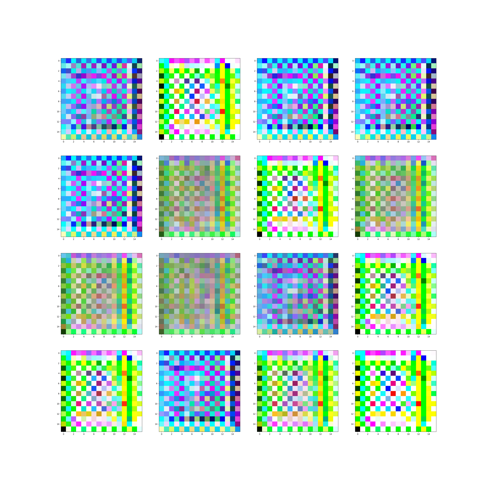

# Dynamically Grown Generative Adversarial Networks

This readme file is an outcome of the [CENG501 (Spring 2022)](https://ceng.metu.edu.tr/~skalkan/DL/) project for reproducing a paper without an implementation. See [CENG501 (Spring 2022) Project List](https://github.com/CENG501-Projects/CENG501-Spring2022) for a complete list of all paper reproduction projects.

# 1. Introduction

Generative adversarial networks (GANs) are a class of neural networks that can generate new data from a distribution generated by the network. GANs are used in image generation, video generation, and other applications. Even though GANs are one of the most exciting new areas of machine learning, they are some issues that are not yet solved. One of these issues is the complexity of the training process. The training process is very time-consuming and requires a lot of data. The training algorithm is also very complex. There are some new ideas in the field of GANs that can help the training process by gradually increasing the complexity of the algorithm. These algorithms start with a more primitive model with fewer parameters that is easier to train than the original model. Then, the model is trained on the same data but with more parameters (more layers). This process is repeated until the model is trained to a good level. ProgGAN is a GAN framework that uses progressive training to train the model. The paper we implemented in this project is Dynamically Grown Generative Adversarial Networks (DGGANS), which directly aims to compete with ProgGAN.

This paper was proposed in AAAI Conference on Artificial Intelligence (AAAI) in 2021 by researchers at University of Michigan, AWS and Princeton University. And our goal in this project is to reproduce the paper in a way that is as close as possible to the original paper.
## 1.1. Paper summary

@TODO: Summarize the paper, the method & its contributions in relation with the existing literature.

Recent work introduced progressive network growing as a promising way to ease the training for large GANs, but the model design and architecture-growing strategy still remain under-explored and needs manual design for different image data. This paper proposed a new novel method to dynamically grow a GAN during training, optimizing the network architecture and its parameters together with automation. The method embeds architecture search techniques as an interleaving step with gradient-based training to periodically seek the optimal architecture-growing strategy for the generator and discriminator. It enjoys the benefits of both eased training because of progressive growing and improved performance because of broader architecture design space. Experimental results demonstrate new state-of-the-art of image generation. Observations in the search procedure also provide constructive insights into the GAN model design such as generator-discriminator balance and convolutional layer choices.
# 2. The method and my interpretation

## 2.1. The original method

The original method first creates a search space of different kernel sizes and amount of filters for both the generator and discriminator. Then, the method iterates between growing the model, and training steps. Growing the model consists of picking between growing the discriminator, growing the generator or increasing the resolution. The model also uses a **Top-K Greedy Pruning Algorithm** for picking the best architecture. The model picks different potential parameters with a probability *p*, and trains the model with these parameters to choose the best architecture depending on the loss. Different than ProgGAN, DGGAN can grow discriminator and generator separately.

## 2.2. My interpretation 

The original paper makes some references to ProgGAN paper, so we also needed to refer to that paper for some parts. The paper makes a reference to including the fade-in block, which we didn't have time to implement. The other thing is that even though the paper is based on CIFAR-10, we used both MNIST and CIFAR for our experiments. We have decided to use MNIST because we believe as it is a smaller dataset and would be easier to train. But after a point the model stopped learning with that, so we have followed the original method and trained on CIFAR-10. We also used k as 2 instead of 20 as stated in the paper for faster training performance.
In the original paper, the starting depth of the kernels is not mentioned, but we decided to use a depth of 8. Our implementation of growing the discriminator is also flawed due to time constraints. We have tried to fix it, but it is not working yet.
# 3. Experiments and results

## 3.1. Experimental setup

The original setup of the paper is said to **"follow the same training schedule as ProgGAN"**. It also mentions that is starts with d_0 8 and grow the dimension to 32x32 gradually. Even though the paper states that it grows up to 32x32, it also gives results for 256x256 images which is a bit confusing. Our computers are not powerful enough to run the full model at larger resolutions, so we could not reproduce the results of the original paper. The paper mentions having 100k iterations after each grow phase, and a single epoch with the d_0 8 in the start takes around 15 minutes in my 2018 MacBook pro, so finishing the training has not been possible.

Our implementation uses [Facebook's pytorch GAN zoo](https://github.com/facebookresearch/pytorch_GAN_zoo) as the base framework. GAN zoo also includes implementation for ProgGAN. We have forked the GAN zoo as a base framework for our implementation of DGGAN. It includes a lot of utility functions, and follows pytorch best practices. If we had more time and computational capacity, it would also have been possible to test ProgGAN. On top of that framework, we have implemented the classes and methods for dynamically grown gan including the pruning algorithm, generator, discriminator, and the training process.

## 3.2. Running the code

The code can be run by calling:
```bash
./download_mnist.sh
./download_cifar.sh
python test.py
```
1.Before training we call generate_action_list() to initialize the action space once. Action space consists of convolutional layers with different kernel sizes and resolution increase.

2.We pick actions from the action_list by random sampling. We predefine the amount of actions to be picked. 

3.According to the actions picked, we call decide_growth() function and decide the modification on the model architecture. Then modify the model. The modifications are grow generator or discriminator by adding convolution layer and increase model resolution. 

4.We train the model.

5.After training finishes, we calculate Inception Scores for each modified model by calling CalculateInceptionScore() function.

6.We choose top-K models according to Inception Scores of modified models and store them for the next iteration.


The modified files on the source code:
  * dggan/models/networks/dynamically_grown_net.py
  * dggan/models/eval/inception.py           
  * dggan/models/loss_criterions/base_loss_criterions.py
  * dggan/models/metrics/inception_score.py
  * dggan/models/trainer/dynamically_grown_gan_trainer.py
  * dggan/models/trainer/gan_trainer.py
  * dggan/models/dynamically_grown_gan.py
  * dggan/models/base_GAN.py
  * dggan/train.py
  * dggan/test.py

## 3.3. Results

We didn't have computational power to reproduce the results, but the numbers presented by the original paper are as follows. The paper improves upon ProgGAN, and demonstrates the following results in the paper. The scores are normalized FID and lower is better.

| **Resolution** |   8 x 8   |   16 x 16   |   32 x 32   |   64 x 64   |   128 x 128   |   256 x 256   |
|:--------------:|:---------:|:-----------:|:-----------:|:-----------:|:-------------:|:-------------:|
| **ProgGAN**    |   29.07   |     23.75   |    27.9     |    16.97    |     29.35     |    10.76      |
|   **DGGAN**    |   24.29   |     21.49   |    19.01    |    8.25     |     13.29     |     8.22      |
| **Improvement**|     16%   |     10%     |     32%     |     58%     |       46%     |      24%      |

Using the default model of the library that we used, we could not produce meaningful results. The generated images of the model became completely black however after adding a convolutional layer at the end of generator model, we obtained the results below. Our convolutional kernel parameters are filter count by 1024 and filter size by 7. Since we could not train the model more due to computational power, we cannot observe the results beyond 10 epochs with only 1 added layer.

<table>
  <tr>
    <th>Epoch 1</th>
    <th>Epoch 2</th>
    <th>Epoch 3</th>
  </tr>
  <tr>
    <td> </td>
    <td> </td>
    <td> </td>
   </tr>
  <tr>
    <th>Epoch 4</th>
    <th>Epoch 5</th>
    <th>Epoch 6</th>
  </tr>
   <tr>
    <td> </td>
    <td> </td>
    <td> </td>
  </tr>
  <tr>
    <th>Epoch 7</th>
    <th>Epoch 8</th>
    <th>Epoch 9</th>
  </tr>
  <tr>
    <td> </td>
    <td> </td>
    <td> </td>
  </tr>
</table>

# 4. Conclusion

The original DGGAN paper proposes a nice and flexible improvement upon existing GAN architectures. It claims to increase the performance for both generated images, and training time. But it still has some pitfalls of other GAN architectures. GANs are not always easy to implement, and Dynamically Grown GANs are not an exception to that. They are even harder to implement. Top-K Greedy Pruning Algorithm is also an idea that promises better results than ProgGAN. The issue with this is you need to train your GAN with **K** new architectures at each epoch. This is a very big computational complexity upon the original GANs and the ProgGAN as ProgGANs have a preset growth schedule.

# 5. References

[DGGGAN](https://arxiv.org/pdf/2106.08505.pdf)

[Pytorch GAN zoo](https://github.com/facebookresearch/pytorch_GAN_zoo)

[ProgGAN](https://arxiv.org/pdf/1710.10196.pdf)

[CIFAR](http://www.cs.toronto.edu/~kriz/cifar.html)

[MNIST](http://yann.lecun.com/exdb/mnist/)

# Contact

[Ege Ucak](mailto:ege.ucak@metu.edu.tr)

[Hasan Dogus Egri](mailto:dogus.egri@metu.edu.tr)
