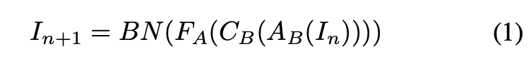
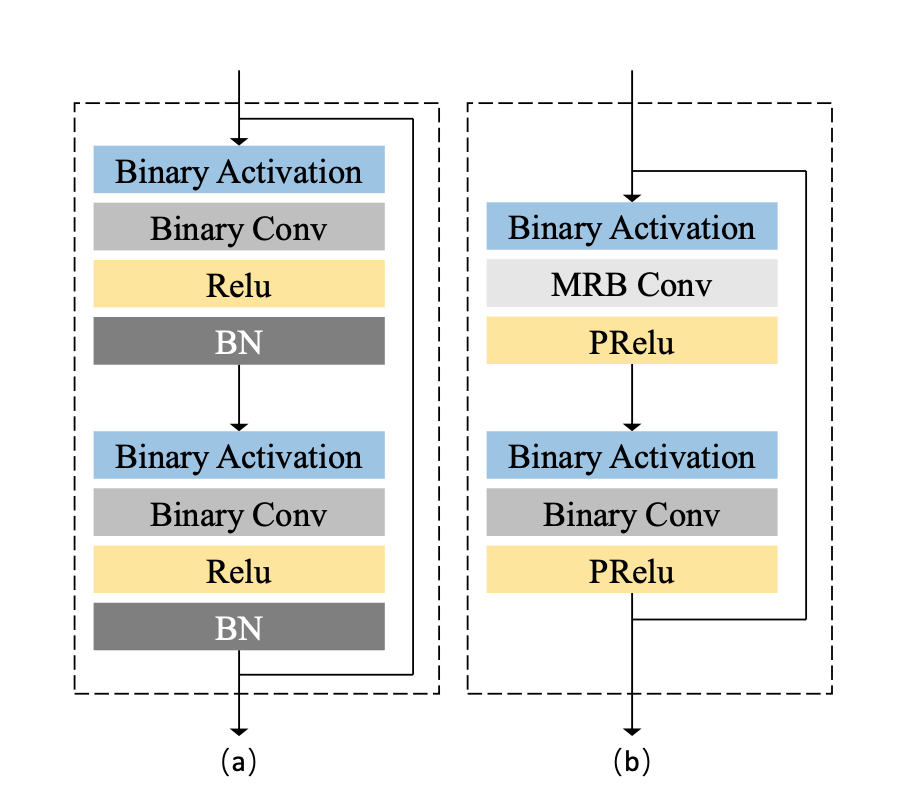
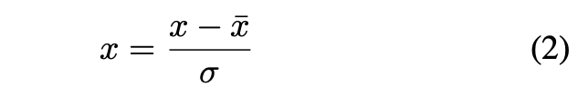
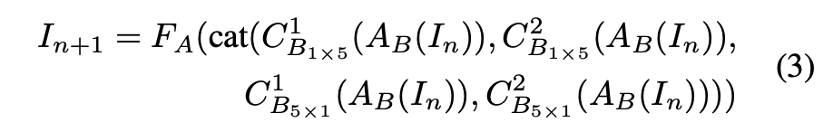
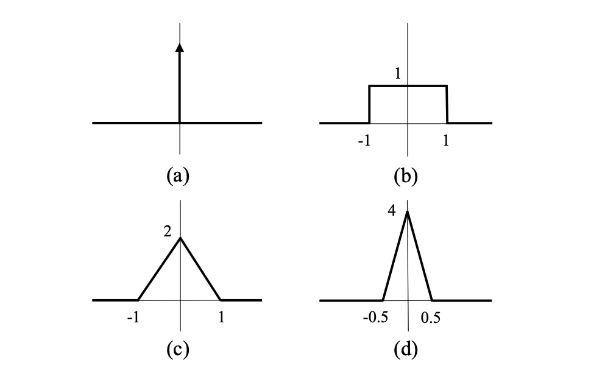
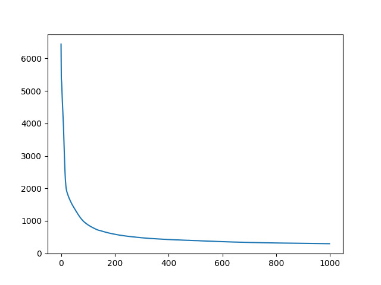
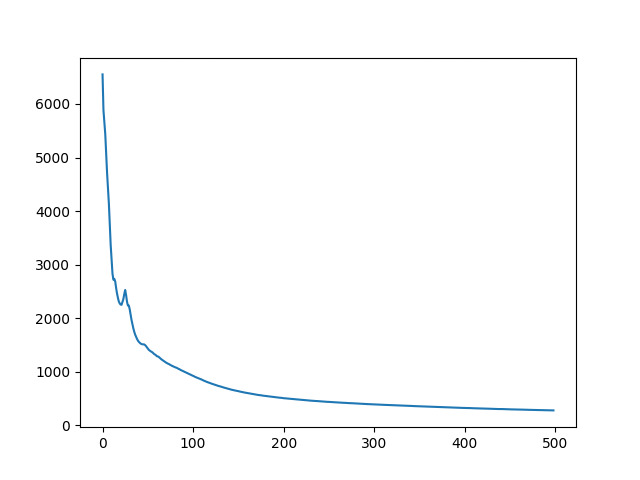
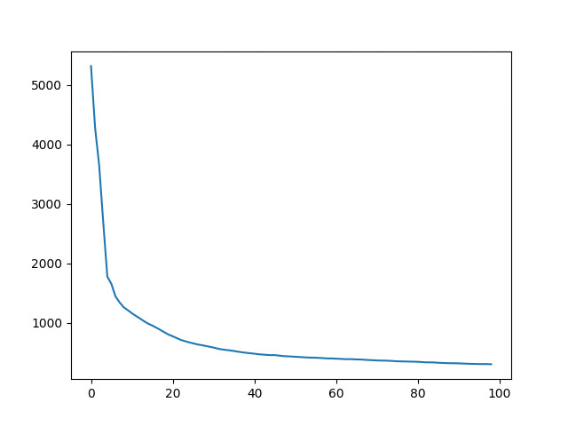

# Training Binary Neural Network without Batch Normalization for Image Super-Resolution

This readme file is an outcome of the [CENG501 (Spring 2022)](https://ceng.metu.edu.tr/~skalkan/DL/) project for reproducing a paper without an implementation. See [CENG501 (Spring 2022) Project List](https://github.com/CENG501-Projects/CENG501-Spring2022) for a complete list of all paper reproduction projects.

# 1. Introduction

Network architectures used in Super Resolution field use batch normalization processes and computations with floating points. Batch normalization processes are the point of the network that require the most processing power and working with floating points makes networks difficult to work on low hardware capacity devices.

In order to overcome these problems Xinrui Jiang, Nannan Wang, Jingwei Xin, Keyu Li, Xi Yang, Xinbo Gao proposed  a method “Training Binary Neural Network without Batch Normalization for Image Super-Resolution” [1]. This study was published in The Thirty-Fifth AAAI Conference on Artificial Intelligence (AAAI-21) proceeding in 2021.

Our aim is to reproduce this study which does not have publicly available source code, to compare the results and to provide a code base for people who will reference this work later.

## 1.1. Paper summary

Binary neural networks produce successful results in Super Resolution field. However, there are serious differences between binary networks and full precision networks in terms of performance. Especially batch normalization processes need powerful hardware as they contain floating point processes. In this paper, new methods that can run on low hardware are proposed. Proposed layers are replaced with the batch normalization step in the existing methods. In this way, it has shown that better results are obtained in terms of performance of state of art methods.

The super resolution is a method of obtaining a higher resolution version of the image from a low resolution image. The purpose of the paper is to train high-accuracy super resolution models without using the batch normalization method. The methods proposed in this paper are as follows. 

- Proposes effective binary training mechanism (BTM) which shows better performance without batch normalization layers. This helps to run network on low-precision devices.
- To show the performance of the proposed method, they find previous well suited optimization methods and compare them. Results show that proposed method surpasses existing binarization methods.
- A novel architecture which uses binary network and novel distillation strategy are proposed to improve existing super resolution methods.

# 2. The method and our interpretation

## 2.1. The original method

### Binary Training Mechanism
In literature binary network in Figure 1a is usually used.  As shown in Equation 1, batch normalization is the last step of method. 


<center></center>

Batch normalizations are so important that they are recentering the input. So input can be limited to {-1 to +1}. But cons of the batch normalization is performance degradation. In this paper, new method which is binary training mechanism (BTM) is proposed to overcome above problem.


<center></center>
<center><b>Figure 1:</b> (a) original binary residual block (b) the proposed
multiple receptive-field binary residual block (MRB)</center>

BTM details are as follows:
- **Weight initialization**: simple initialization scheme Xavier uniform distribution is used because it is more stable.

- **Data initialization**: SR network's inputs are normalized to be stable. Equation 2 is used for normalization process. In Equation 2, x denotes the input,  ̄x denotes the mean and σ denotes standard deviation for low resolution images set. After high resolution image is predicted by model, mean image is added to predicted image. This makes network more stable.

<center></center>


- **Activation**: PRelu which is suitable for binary networks is introduced.

### Network Structure

Multiple receptive-field (MRB) shown in Figure 1b is used for ease to information loss. It is adopted that 1 x 5 and 5 x 1 convolution operations are used. MRB is expressed as in Equation 3.

<center></center>

## 2.2. Baseline

### 2.2.1 Network Settings

The method in paper uses binary convolution layers except first and last layer. To be consistent with existing works[2] it uses full precision convolution layers in first and last layer.

### 2.2.2 Block Structure

Proposed BTM uses block settings as in Figure 1b.

### 2.2.3 Optimization

In forward phase scaling factors introduced in [3] is used to minimize quantization error. Due to sign function in Figure 2a is not differentiable, higher-order estimators[4][5] are used as activation and weight approximation function.

<center></center>
<center><b>Figure 2:</b> The derivative of sign function and different ap- proximations for it</center>

## 2.3. Our Interpretation

Each input image is cropped with some scale factor but paper unspecified the number of crop size of single image. We adjust it to 5. So each input image produces 5 cropped images.

Epoch number for training is also unspecified. We tried several epoch numbers like 500, 1000 and 15000. Scale factor 2 and 3 are used with 500 epochs, scale factor 4 is used with 1000 and 15000 epochs. We tried to find max epoch number which achieve to minimum loss value.

It is not mentioned in the paper that how mean and standard deviation are calculated for test data. We calculated new mean and standard deviation from test dataset for test phase.

Loss function is not specified in the paper for base results. We selected mean square error (MSE) as a loss function.

Due to our personal computer resource limitations we trained our model with less train dataset. They are first 300 high and 300 low resolution images after sorted.

# 3. Experiments and results

## 3.1. Experimental setup

We used DIV2K image set to train the model. Downloaded 300 high and 300 low resolution images out of 800 were used. Each input image is croped randomly for 5 times. As a result 1500 images are used in training phase. After crop is completed, each image is normalized by subtracting the mean of set and divided by standard deviation of set. CPU was used while training model. Learning rate has been halved every 500, 1000, 1500, 2000, 5000, 7000, 9000 epochs.

Batch size of the training data is 16 and learning rate is set to 0.0001. As an optimizer Adam with β1 = 0.99 and β2 = 0.999 is used. We selected mean square error (MSE) loss function to compare results.

## 3.2. Running the code

Our repo contains file as:
```
root
│─── images
│ 
│─── scripts/
│       │─── data/
│               │─── DIV2K/
│                       │─── DIV2K_train_HR/
│                       │─── DIV2K_train_LR_bicubic/ 
│                               │─── X2/
│                               │─── X3/
│                               │─── X4/
│               │─── test/
│                       │─── benchmark/
│       │─── blocks.py 
│       │─── dataset.py 
│       │─── div2k_downloader.sh 
│       │─── main.py 
│       │─── main_for_test.py 
│       │─── model_weights_x2.pt 
│       │─── model_weights_x3.pt 
│       │─── model_weights_x4.pt 
│       │─── networks.py 
│       │─── utils.py 
│ 
│─── README.md
│ 
│─── requirements.txt
```

images directory contains documentation images. scripts/data folder will be created after dataset download script is run.
Our directory contains bash scripts which name are "div2k_downloader.sh" and "div2k_downloader.sh" to download DIV2K, Set5, Set14, Urban100 and BSD100 datasets and unzip them. Firstly it should be run. 
```
./scripts/div2k_downloader.sh
```
```
./scripts/test_dataset_downloader.sh
```
This will create data folder under scripts and will download and unzip DIV2K image dataset.

After download completed python based libraries should be installed.

```
pip3 install -r requirements.txt
```

To run and train model, main.py should be run lastly.

```
python scripts/main.py
```

To test model, main_for_test.py can be run.

```
python scripts/main_for_test.py
```

Trained model weights which was trained with 15000 epochs with scale factor of 4 are saved to model_weights.pt file. It can be load to model and reuse for testing. It can be reload to model and the model can be use for testing.
## 3.3. Results

Loss values from root mean square error for each model are presented in Figure 3, Figure 4 and Figure 5. 


<center></center>
<center><b>Figure 3:</b> Loss graph for training data with scale factor 4 and for first 1000 epochs.</center>


<center></center>
<center><b>Figure 4:</b> Loss graph for training data with scale factor 2 and 500 epochs.</center>


<center></center>
<center><b>Figure 5:</b> Loss graph for training data with scale factor 3 and 100 epochs.</center>

| Scale Factor        | 100   | 500  | 15000 | 
|---------------------|-------|-------|------|
| x2                  | 311.76| 281.31|      | 
| x3                  | 307.06|       |      | 
| x4                  |       |       |261.11|
<center><b>Table 1:</b> MSE loss of train set for epochs</center>

\
In paper, the best psnr value was obtained as 31.06 for scale factor of 4, while in our study, we obtained the best value as 21.47 in Set 5. The values we obtained in this study showed that we reached worse results than the values obtained in the paper.

| Scale Factor        | Set5  | Set14 | B100 | Urban100 |
|---------------------|-------|-------|-------|---------|
| x2                  | 17.93 | 19.19 | 18.12 | 19.01   |
| x3                  | 18.19 | 16.62 | 16.72 | 17.69   |
| x4                  | 21.47 | 18.18 | 19.54 | 18.08   |
<center><b>Table 2:</b> Psnr of test set</center>

\
We actually expected better results in x2, but we got better results in x4. This is because the x4 was trained more time with more epochs.


# 4. Conclusion

Since all parameters  in paper were not clearly specified for model training, we determined these unclear points in our study. Therefore, we could not obtain the exact results in the paper. In the train phase, we obtained psnr values close to the results specified in the paper. Another point to be noted is that since we used our personal computers in the train phase, our resources were not sufficient to train models using the entire dataset. So we trained the model using part of the dataset. Therefore, the success of the model has not been as high as stated in the paper. We had to train 15000 epoch for an average of 15 hours. That's why we didn't get a chance to try any more epochs. Since the number of epochs was not specified in the paper, it could not be tested with more epochs.

Since the weights are binarized, the computational complexity is mostly on the batch normalization side. By removing the batch normalization layer in paper, both better results were obtained and a more suitable model for working on devices with low resources was proposed. Since not all parameters are specified in the paper, it is very difficult to reproduce the same results.

# 5. References

[1] [Jiang, X., Wang, N., Xin, J., Li, K., Yang, X., & Gao, X. (2021). Training Binary Neural Network without Batch Normalization for Image Super-Resolution. Proceedings of the AAAI Conference on Artificial Intelligence, 35(2), 1700-1707](https://ojs.aaai.org/index.php/AAAI/article/view/16263)

[2] Xin, J.; Wang, N.; Jiang, X.; Li, J.; Huang, H.; and Gao, X. 2020c. Binarized Neural Network for Single Image Super Resolution. In ECCV.

[3] Rastegari, M.; Ordonez, V.; Redmon, J.; and Farhadi, A. 2016. Xnor-net: Imagenet classification using binary convolutional neural networks. In ECCV.

[4] Liu, Z.; Wu, B.; Luo, W.; Yang, X.; Liu, W.; and Cheng, K.-T. 2018. Bi-real net: Enhancing the performance of 1- bit cnns with improved representational capability and ad- vanced training algorithm. In ECCV.

[5] Xu, Z.; and Cheung, R. C. 2019. Accurate and Compact Convolutional Neural Networks with Trained Binarization. arXiv preprint arXiv:1909.11366 .

# Contact

- **[Oğuz Gödelek](https://github.com/oguzgodelek) :** oguz.godelek [at] metu.edu.tr
- **[Gürcan Kavakçı](https://github.com/gurcankavakci) :** gurcan.kavakci [at] metu.edu.tr 


