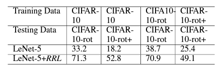

# RRL: Regional Rotation Layer in Convolutional Neural Networks

This readme file is an outcome of the [CENG501 (Spring 2022)](https://ceng.metu.edu.tr/~skalkan/DL/) project for reproducing a paper without an implementation. See [CENG501 (Spring 2022) Project List](https://github.com/CENG501-Projects/CENG501-Spring2022) for a complete list of all paper reproduction projects.

## 1. Introduction

@TODO: Introduce the paper (inc. where it is published) and describe your goal (reproducibility).
CNN has great proccesses in many tasks such as image classification in deep learning. However, because of the defficiency of the ability to process large image rotation of images, CNN can fail to classify images. CNN is used many fields such as biomedical,astronomi and industry. Therefore, rotation invariance of neural networks has been more important. There are other techiques in the literature like, [1, 2] or well-known regularization method - data augmentation that makes model to see rotated images too, and learn their feature. However, this increases the amount of data, and cost of the training, model based strategies increases the number of parameters. In this paper we make feature maps before and after CNN rotation equivariant, so the whole CNN is rotation invariant, without any new parameter. Main techniques :
      1) Local Binary Pattern Operator based Regional Rotation Layer(RRL) reproduced.
      2) Without new parameters, RLL make feature maps .
      3)Evaluated RLL with Lenet-5,ResNet-18

### 1.1. Paper summary

First, all of the datasets Cifar-10,Cifar10-rot(rotated with angle 0,90,180,270 images),Cifar10-rot+(rotated with angle in range[0,360)) datasets evaluated for the models trained without RRL and with RRL. Without new parameters, RLL makes the feature maps before and after convolution equivarience, and so makes the entire NN rotation invariant With rotation angles 0, 90, 180, 270 the feature maps are exactly same. With arbitrary rotation angle, there is small distinctions between feature maps. Finally, we have made reproducible RRL layer that can be used in any CNN architecture and created automated training and testing for LeNet5 and ResNet18 on Cifar-10 dataset.  

## 2. The method and my interpretation

### 2.1. The original method

The standard convolutional neural networks do not have the property of rotation invariance. Trained by the upright samples, the performance drops significantly when tested by the rotated images. In the paper, there are two level of operations: feature level - RRL: Regional Rotation layer, which is global, and window level - Local Binary Pattern operation, which is local. The algorithm below shows how RRL works on feature maps.

<p align="center">
  
</p>

RRL is applied along each axis seperately, and based on given kernel size, it slides over each channel and for each sliding window Local Binary Pattern is applied to all the rotated versions of that window. Then, window is replaced by its rotated version that gives the minimum LOcal Binary Pattern. Below is explanation of how Local Binary Pattern is calculated for 3x3 window:

<p align="center">
  
</p>

First of all, center value is taken as threshold, and used to produce the binary matrix: if value is less than threshold, put 0, otherwise 1. Then starting by upper left, power matrix is generated as powers of 2, without considering the threshold value. Then Hadamard product of the binary and power matrix is calculated and summed up to produce LPB value, which is 169 in this example. By checking all the rotated versions of this example, by keeping the center fixex, one can conclude that 225 degree counterclockwiese rotation produces the lowest LPB value - 30.

### 2.2. My interpretation

In the paper, how RRL woks globally was not interpreted clearly, so we have to figure it out, so we used stride as the same as kernel size to avoid the overlapping and created a matrix of sliding windows. In the architecture, it is necessary that feature map size is divisible by kernel size, so zero padding is added where it was necessary so that all the features participates. For example, if originial image size is 33x33, with 3 channels and 128 batch size, then we have an input matrix with dimensions - 128x3x33x33. If we take the kernel size 3x3, then along the height and width there will be, 33 / 3 = 11 windows. So in total, for one channel there are 11 * 11 = 121 windows, and if we permute the order of the dimensions, with this 121 and the channel dimension, we get new sliding window matrix with size - 128x121x3x3x3. We also have function to find the minimum LPB state of the given window. For example, if we have 3x3 kernel, by considering the original window 0 degree rotation, our function calculates LPB for all nine rotation states by keep tracking of the rotation producing the minimum LPB, then it returns that rotated version of matrix. We call our function `min_lpb` and apply it for all the sliding windows seperately. Unfortunately, operations used to find the minimum LPB state, cannot be broadcasted to all the sliding windows. Unlike the other layers, like Convolution layer sliding window operations are element-wise multiplication and summation or MaxPooling where it is the finding max value, operations can be done by using PyTorch directly, like with `sum` with elementwise-multiplication `*`, or `max`. These operations are supported by PyTorch to vectorize to apply over the dimensions needed. However, our custom function is based on rotation and not directly based on summation, matrix multiplication or finding the max value. Therefore we needed vectorize our function ourselves. The only possibility in PyTorch is using `vmap` from `functorch` library. But this function vectorize the oprations used between 2 or more matrices. Therefore we could not come up with the solution to handle this problem. We also looked how Convoliton layer is calculated as general matrix multiplications, GEMM, but it was not helpful to find the minimum state of each sliding window. Because, traditional layers, there is consistency, however in our rotation-invariance method, each window can result in a different rotation and there is indepence between all the sliding windows and channels, and we have no weight matrix whose matrix multiplication can be optimized. Due to all these reasons,t there was no way of make use of GPU for  `min_lpb` function, and we used multiprocessing. However, we want our project be a global use, so that our implemented RRL layer can be used by anyone and in any CNN architectures, by just importing RRL, and putting x = RRL(x), before each convolution layer, and before the fully-connected layers if the task is classification. Therefore, we created the PyTorch discussion on how to broadcast the custom functions in PyTorch to take advantage of the GPU, if there is some update we will optimize the solution. Even if it is after grading, we will try to optimize our solution to make our project impactful. We have trained LeNet5 and ResNet18 with RRL for 10 epochs and without RRL layer for 100 epochs, both have batch size 128, and images are resized by 33x33. For LeNet5 with RRL layer, we have put our implemented RRL layer before each convolutional layer and before the fully connected layers. In ResNet18, we have used RRL layers before the first Convolution layer and before each Residual blocks, and inside the blocks do not contain RRLs.

## 3. Experiments and results

### 3.1. Experimental setup

In this experimet we use google colab, with [Python 3.7](https://www.python.org/downloads/release/python-370/)

- Dataset and Lenet-5 Cifar-10 is used.
- Resnet-18 and Cifar-10 is used.

Required libraries:

- [Pytorch](https://pytorch.org/)
- [Torchvision](https://pytorch.org/vision/stable/index.html)
- [Scikit-Learn](https://scikit-learn.org/stable/)
- [Matplotlib](https://matplotlib.org/)

### 3.2. Running the code

We have made not only our results reproducible, but also created a seperate Python Project under `src` folder. So our project is not just bunch of jupyter notebook experiments and results, we have taken our approach from jupyter notebooks, and orginize the method in seperate Python folders, and other can simply take our RRL implementation and use it in their neural network architectures. We have documented and add typing to all the functions and classes, to make it professional so that anyone can understand what we are doing and look the docstrings or required data types of the functions directly in their environment. We have also added comments for implementation of the RRL layer, if anyone interested can understand how it works can we have put track of the dimensions of the input matrix so that one can get the idea how things are changing. Below is the structure of our whole project:

Project_Mahammadli_Gokce

- src
  - `__init__.py`
  - `dataloader.py`
  - `layers.py`
  - `lpb.py`
  - `models.py`
  - `test.py`
  - `requirements.txt`
- experiments
  - `With_RRL.ipynb`
  - `Without_RRL.ipynb`
- images
  - `LPB.png`
  - .
  - .
  - .
  - `RRL.png`
- models
  - `lenet5_with_rrl.pth`
  - `lenet5_without_RRL.pth`
  - `resnet18_without_RRL.pth`
- results
  - `Results.ipynb`

`images` are containing pictures of the algorithms used, and results that will be given in section 3.3. `experiments` folder containing jupyter notebooks for training of LeNet5 and ResNet18 on Cifar-10 dataset without adding RRL layer and with RRL layer. `models` folder contains some of trained models. `src` part contains necessary files to reproduce the results. We have created `train.py`, that can be runned from the cmd or terminal with suitable flags for automatic training to train the model, get training accuracy and loss graphs, training time used, and saved, trained model, and `test.py` to test the saved model and produce the classification report containing the accuracy, precision, recall, f1-score for all the classes seperately, and averaged results. 

### Reproducing the results

Clone the poject in your computer and change directory to `src`:

```bash
git clone https://github.com/CENG501-Projects/CENG501-Spring2022.git
cd Project_Mahammadli_Gokce/src
```

It is recommended to use virtual environment, you can create one with:

```bash
python -m venv env
```

It will create virtual environment named env, and you need to activate it, for Windows, under the env/Scripts, there is `activate.bat` file, put it in the cmd and run it, you should see the `(env)` on the left part of the cmd.

For Linux:

```bash
source ~/env/binb/activate
```

Then install the necessary libraries to your environment:

```bash
pip install -r requirements.txt
```

Now you can train and test the models, to reproduce our results. You can automatically do that by following the instructions below:

### Train.py

```bash
usage: train.py [-h] [--rrl] [--no-rrl] [--model_name MODEL_NAME] [--image_size IMAGE_SIZE] [--batch_size BATCH_SIZE] [--epochs EPOCHS]
                [--lr LR] [--model_destination MODEL_DESTINATION] [--plot] [--plot_destination PLOT_DESTINATION] [--verbose]

Model Training Program.

required arguments:
  --rrl                 use this command to train model with RRL layer.
  --no-rrl              use this command to train model without RRL layer.
  --model_name MODEL_NAME
                        name of the model to train: lenet5 or resnet18.

optional arguments:
  -h, --help            show this help message and exit
  --image_size IMAGE_SIZE
                        height and width of the input image. should be divisable by three.
  --batch_size BATCH_SIZE
                        size of each batch for training.
  --epochs EPOCHS       number of epochs to train.
  --lr LR               learning rate for the optimizer.
  --model_destination MODEL_DESTINATION
  --plot                pass it without any value to draw training loss and accuracy.
  --plot_destination PLOT_DESTINATION
                        if you have passed --plot_training argument, use this flag with corresponsing path to store the plot.
  --verbose             If True, loss and accuracy during training will be printed out. default True
```

You can pass `model_name` flag with either lenet5 or resnet18 to train one of these models, `rrl` and `no-rrl` controls whether to use RRL layer inside the model or not. Other arguments are optional and default values are our implementation, however you can change them as you wish. `image_size` is used to resize Cifar-10 images while loading them, `batch_size`, `epochs`, `lr` are clear from their names, they are for what size each batch should be, number of epochs to train, and the learning rate. `model_destination` is the parent folder where you want to save the mode, do not worry about the naming of the model, it will be based on your choice of the model. `plot` is used to produce training loss and accuracy graphs, default is True, you can pass the `plot_destination` to clarify where to store the graphs, default is current folder. `verbose` is used to print interim results during the traning, defualt is True.

Sample training code:

```bash
python train.py --model_name lenet5 --rrl
```

This code will train LeNet5 with RRL layer.

### Test.py

```bash
usage: test.py [-h] [--model_name MODEL_NAME] [--model_path MODEL_PATH] [--image_size IMAGE_SIZE] [--batch_size BATCH_SIZE]
               [--report_destination REPORT_DESTINATION]

Model Testing Program.

required arguments:
  --model_name MODEL_NAME
                        name of the model to test: lenet5 or resnet18.
  --model_path MODEL_PATH
                        Path to the saved, trained model.
  --image_size IMAGE_SIZE
                        height and width of the input image. should be divisable by three and the same as in the training loader.
  --batch_size BATCH_SIZE
                        size of each batch for training. should be the same as in the training loader

optional arguments:
  -h, --help            show this help message and exit
  --report_destination REPORT_DESTINATION
                        path to the folder to store the clasification report
```

After you train your model, you can use this file to test the performance of your model based on two test sets: Cifar-10-rot, and
Cifar-10-rot+ which are explained in section 1.1. You need to path `model_name` you trained, in our case it was 'lenet5', `model_path` path where your model - `pth` file is saved, we did not specify the path during training, so it should in in the current directory, if you look there you will see the `lenet5_with_rrl.pth` file, `image_size` the size used for resizing images during training, in our case it was default 33, it is for consistency, and `batch_size` you want for your batches. If you run with these flags, it will print out the classification report for given model based on mentioned two test sets, and `report_destionation` specifies where to store the classification report texts, default is current folder. If you pass that flag, put only the folder you want the report to be appear, the rest will ba handled, naming etc.

Sample testing code

```bash
python test.py --model_name lenet5 --model_path './lenet5_with_rrl.pth' --image_size 33 --batch_size 128
```

### 3.3. Results

Results can be found in the directory `src/results`, we have tested LeNet5 and ResNet18 models on Cifar-10-rot and Cifar-10-rot+ test datasets with RRL and without RRL layers. Below are some example images from both test datasets:

<figure align=center>
  
  <figcaption align=center>Cifar-10-rot</figcaption>
</figure>

<figure align=center>
  
  <figcaption align=center>Cifar-10-rot+</figcaption>
</figure>

Reslts for loss and accuracy during the training is given below:

### LeNet5 Without RRL

<figure align=center>
  
  <figcaption align=center>Accuracy</figcaption>
</figure>

<figure align=center>
  
  <figcaption align=center>Loss</figcaption>
</figure>

### ResNet18 Without RRL

<figure align=center>
  
  <figcaption align=center>Accuracy</figcaption>
</figure>

<figure align=center>
  
  <figcaption align=center>Loss</figcaption>
</figure>

Now, let's anaylze the test scores of our implementation with the original paper

### LeNet5

<figure align=center>
  
  <figcaption align=center>Original Paper</figcaption>
</figure>

<figure align=center>
  
  <figcaption align=center>Our Implementation - rot</figcaption>
</figure>

<figure align=center>
  
  <figcaption align=center>Our Implementation - rot+</figcaption>
</figure>


### ResNet5 

<figure align=center>
  
  <figcaption align=center>Original Paper</figcaption>
</figure>

<figure align=center>
  
  <figcaption align=center>Our Implementation - rot</figcaption>
</figure>

<figure align=center>
  
  <figcaption align=center>Our Implementation - rot+</figcaption>
</figure>

If we analyze the results, scores are similar and having limited to run results with RRL layers on CPU, as it was not possible to run on GPU, we are restricted RRL models to only 10 epochs from scratch training. In the paper it has been mentioned to train the model for *100 000* epochs, which both seemed very unnecessary as results saturated after a few hundred epochs.  

## 4. Conclusion

In conclusion, we implemented the RRL: Regional Rotation Layer in Concolutional Neural Networks paper, in PyTorch. As paper was not indicating clear idea about the working principle of the methodology, we had to figure out how it works, how to generate sliding windows, like should they overlap or no overlap. We find out that having stride same as kernel size works better, and implemented the minimum LPB state finder function and adapted it inside our RRL layer. By, using our RRL layer in CNN architectures like LeNet5 and ResNet18 we get rotation invariant models, without adding a new parameter. Besides, paper does not mention their training parameters, like, number of epochs, batch size, kernel size used for RRL sliding window, optimizer used in the paper etc. So we had to hyper-parameter tuning and put the best results. After all the experiments and testing, we crated reproducible RRL layer that can be adapted into any architecture, we plan to optimize our implemntation further and make make it suitbale for PyTorch environment and introduce the layer to be added to PyTorch layers. We also plan to check its performance not only in simple CNN architecture, but also much deeper CNNs and also in Vision Transformer. 

## 5. References

[1] Follmann, P.; and Bottger, T. 2018. A        rotationally-invariant convolution module by feature map back-rotation. In 2018 IEEE Winter Conference on Applications of Computer Vision (WACV), 784–792. IEEE.

[2] Gao, L.; Li, H.; Lu, Z.; and Lin, G. 2019. Rotationequivariant convolutional neural network ensembles in image processing. In Adjunct Proceedings of the 2019 ACM International Joint Conference on Pervasive and Ubiquitous Computing and Proceedings of the 2019 ACM International Symposium on Wearable Computers, 551–557. London: Association for Computing Machinery,New York.

## Contact

- Kanan Mahammadli
  - [kanan.mahammadli@metu.edu.tr](mailto:kanan.mahammadli@metu.edu.tr)
  - [Linkedin](https://www.linkedin.com/in/kananmahammadli)

- Fatma Ceyda Gökçe
  - [fcg.13@hotmail.com](mailto:fcg.13@hotmail.com)
  - [Linkedln](https://www.linkedin.com/in/fatma-ceyda-gokce)
