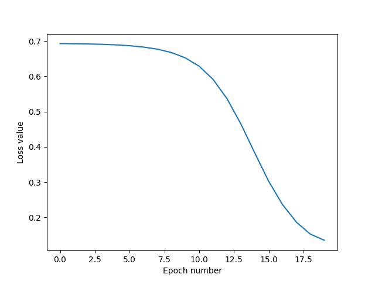
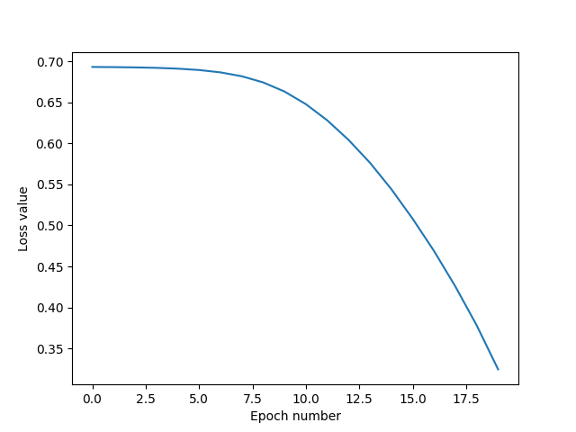
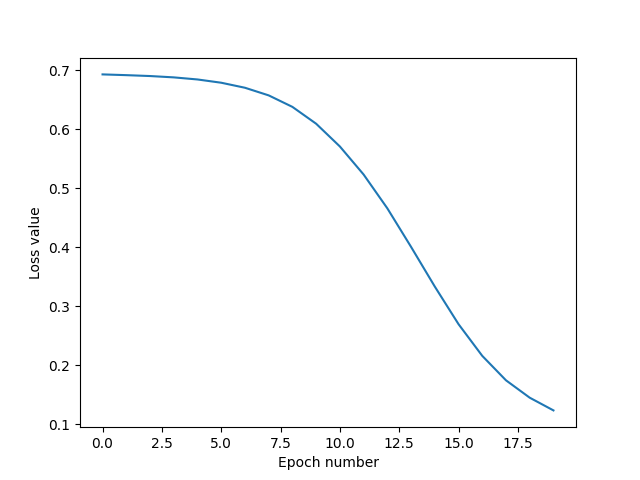

# Self-supervised Graph Neural Networks via Diverse and Interactive Message Passing

  

This readme file is an outcome of the [CENG501 (Spring 2022)](https://ceng.metu.edu.tr/~skalkan/DL/) project for reproducing a paper without an implementation. See [CENG501 (Spring 2022) Project List](https://github.com/CENG501-Projects/CENG501-Spring2022) for a complete list of all paper reproduction projects.

  

# 1. Introduction

The [paper](https://www.aaai.org/AAAI22Papers/AAAI-4030.YangL.pdf) (Yang et al., 2022) is published in AAAI 2022. The authors propose a method to overcome the over-smoothing issue being observed in the Graph Neural Networks. In this project, I tried to re-implement and evaluate the model using the descriptions given in the paper.

  

## 1.1. Paper summary

The over-smoothing is an important problem for the GNN models. As the depth of the GNN models increases, the representations of the nodes in graphs become similar to each other. The authors described the two factors responsible for over-smoothing in deep GNN: blind message and uniform passing.

In the traditional GNN models, the messages aggregated from the neighbors do not depend on the target node that the messages flow into. That means, regardless of the neighbor, a source node creates the same message. The authors call this situation the blind message. According to them, the message should be created based on the node pairs (source node, target node) rather than considering only the source node.

Additionally, during the aggregation of the messages, all messages are treated equally. The authors suggest that the messages should have different propagation weights, as different messages might have different influences on the neighbors.

To solve these two problems, the authors propose a method named DIMP (Diverse and Interactive Message Passing). In DIMP, nodes create different messages for different target nodes. That means rather than having a message for each node; we have a different message for each edge in the network. For each source user u and target user v, the message is created for the k^{th} layer by dividing the element-wise multiplication of h^{k-1}_v and h^{k-1}_u by the inner product of h^{k-1}_v and h^{k-1}_u, where h^{k-1}_v and h^{k-1}_u denote the hidden representations of node v and u obtained in the (k-1)^{th} layer. These messages are aggregated using vectorial summation.

DIMP is an unsupervised model, and the authors use the infomax-based objective function. Basically, there exists a discriminator layer inside the model, which takes the hidden representations of the nodes calculated in the k^th layer and the s parameter, which represents the overall graph. s parameter is calculated by averaging the representations of all nodes in the graph. Additionally, the authors also provide the hidden representations of the negative samples to the Discriminator. The outputs of the Discriminator for these two types of nodes are used in the loss function, which is Binary Cross-Entropy Loss.

The model outperforms the existing GNN models on node classification, node clustering, and graph classification tasks. Additionally, the authors explain the theoretical background of their approach.


# 2. The method and my interpretation

  

## 2.1. The original method

The original method uses DIMP Layer and a Discriminator Layer in the model.

- In k^{th} DIMP Layer, to obtain the hidden representation of the node v, for each neighbor u of node v, the message is calculated by dividing the element-wise multiplication of h^{k-1}_v and h^{k-1}_u by the inner product of h^{k-1}_v and h^{k-1}_u, where h^{k-1}_v and h^{k-1}_u denote the hidden representations of node v and u obtained in the (k-1)^{th} layer. The authors do not mention the hidden layer sizes or whether they used the same hidden layer size for every DIMP Layer.

- In Discriminator, the authors use the Bilinear layer to calculate the outputs. This step was straightforward as they used the same approach given in the (Veličković et al., 2019).

During the training,

- The authors use mini-batch training; however, they do not describe how they split the graph into batches.

- The authors mention that they split the data as training, validation, and test sets. However, whether they use all the data during the node embedding step or they use only the nodes in the training set is not described in the paper. This causes ambiguity since some of the models in the literature use all the data during node embedding and use the training data only in the training of the classifier models.


During the testing,

- The authors mention SVM and KMeans in the node classification and clustering sections. Similar to the problem described above, they did not describe how they use training, validation, and test sets during the training of these classifier models. One can use all the data in KMeans and compares the predicted labels with the real labels or fit the model using only the training set and later predicts the labels of the nodes in the test set.


Additionally, the dataset statistics given in the paper are different from the actual statistics. Although the number of nodes in Cora, CiteSeer, and PubMed matches the statistics I found, the numbers of edges given in the paper are less than the ones I have.

  

## 2.2. My interpretation

- I used the same hidden layer sizes for all the DIMP Layers. I chose the hidden layer size as 256.

- I did not use mini-batch training. I trained the model using the full-batch strategy.

- I used the whole data to train the DIMP model without considering the training-test split. Later, when I trained the classifiers using the node embeddings generated by the model, I used the nodes in the training set to train the model and the ones in the test set to evaluate the performance of the model.

- To understand the parts that are not described in the paper, I read the Deep Graph Infomax (Veličković et al., 2019) and Semi-Supervised Classification with Graph Convolutional Networks (Kipf and Welling, 2016). I also benefit from the GitHub repo given at https://github.com/PetarV-/DGI during the implementation of the Discriminator and the loss function.

  

# 3. Experiments and results

  

## 3.1. Experimental setup

  
- Original paper uses mini-batch training. However, their batching strategy is not explained in the paper. Batching in the graphs is a complex problem due to the links between the nodes, and the strategy used during the creation of batches might affect the performance of the model; I decided to use full-batch training. 

- Original paper uses early-stopping; I didn't need to use early-stopping since the loss converged approximately in 20 epochs in all the datasets I used.

- Original paper uses 20 nodes per class for training and 20 nodes per class for validation. I did not create any validation set but rather added the nodes designated for the validation to the training set.

- The dimensions of the hidden layers are not given in the original paper. Therefore I needed to choose an appropriate value for the size of the hidden layers, which is 256.

- The activation function used in the DIMP layers is not mentioned in the original paper. I decided to use ReLU to avoid the vanishing-gradients problem.

- As I understand, the authors use SVM and KMeans for node classification and clustering tasks. For both SVM and KMeans, I used the embeddings of the nodes in training set to train these models and the embeddings of the nodes in the test set to evaluate the performance of the model. For SVM, I chose the regularization parameter as 10.

- In the original paper, several other datasets were used (e.g., Amazon-C), however, I was not able to use these datasets, as I trained the model in Google Colab, and these datasets caused the model to exceed the memory limit during the training. I tested the model on node classification and clustering tasks and omitted the graph classification task due to the same reason.


To sum up, the hyperparameters used during the training of the model are given below;

|Parameter|Value|
|--|--|
|Epochs|20|
|Learning Rate|0.001|
|Weight Decay|0.01|
|Hidden Dimension|256|
|Number of DIMP Layers|4|
|SVM regularization parameter|10|
  

## 3.2. Running the code

  

The project directory contains the Python files described below;

  

-  **models.py**: contains the implementation of the DIMP model.

-  **layers.py**: contains the DIMP layer and discriminator layer implementations.

-  **dataset.py**: contains the functions and classes to load the required datasets (e.g., Cora, CiteSeer, etc.).

-  **utils.py**: contains the utility functions.

-  **train.py**: contains the train function which is used to train the DIMP model.

-  **test.py**: contains the test functions to evaluate the performance of the model.

-  **run.py**: the main file to train and test the DIMP model.

  

Additionally, the directory contains the folders described below;

  

-  **/embeddings**: to store the embeddings using the export_embeddings function.

-  **/data**: to store the data using the export_data function.

-  **/figures**: to store the loss history figures using the visualize_loss function.

  

**run.py** is the file that contains the codes to train-test the model. One can simply run the file by using;

```

python run.py

```

  

The parameters whose value can be adjusted by the users are given below;

  

|Parameter|Type|Default value|Description|
|--|--|--|--|
|--dname|str|Cora| Dataset name (e.g., Cora, CiteSeer, PubMed)|
|--seed|int|1234| Random seed|
|--epochs|int|20|Number of epochs|
|--lr|float|0.001|Learning rate|
|--weight_decay|float|0.01| Weight decay |
|--hidden_dim|int|256|Dimension of the hidden units|
|--num_layer|int|4|Number of layers
|--C|int|10|SVM regularization parameter|

  
  

The user can also view the available parameters by using the command below;

```

python run.py -h

```

  

To use the command-line arguments;

```

python run.py -[arg name]

```

  
  
  
  

## 3.3. Results
I presented the results obtained for the node classification and clustering tasks below;

### Cora

#### Dataset Statistics
- **# of nodes:** 2,708
-  **# of edges:** 10,556
- **# of features:** 1,433
- **# of classes:** 7

#### Loss versus Epoch
<center></center>
<center>Figure 1: Loss versus Epoch for Cora Dataset</center>

#### 1. Node Classification
|&nbsp;| Accuracy|
|--|--|
|Original|0.833
|My implementation|0.200

#### 2. Node Clustering
|&nbsp;| NMI| ARI |
|--|--|--|
|Original|0.581|0.522|
|My implementation|0.009|0.008


### CiteSeer

#### Dataset Statistics
- **# of nodes:** 3,327
-  **# of edges:** 9,104
- **# of features:** 3,703
- **# of classes:** 6

#### Loss versus Epoch
<center></center>
<center>Figure 2: Loss versus Epoch for CiteSeer Dataset</center>


#### 1. Node Classification
|&nbsp;| Accuracy|
|--|--|
|Original|0.733
|My implementation|0.401

#### 2. Node Clustering
|&nbsp;| NMI| ARI |
|--|--|--|
|Original|0.471|0.471|
|My implementation|0.026|0.004

### PubMed

#### Dataset Statistics
- **# of nodes:** 19,717
-  **# of edges:** 88,648
- **# of features:** 500
- **# of classes:** 3

#### Loss versus Epoch
<center></center>
<center>Figure 3: Loss versus Epoch for PubMed Dataset</center>


#### 1. Node Classification
|&nbsp;| Accuracy|
|--|--|
|Original|0.814
|My implementation|0.374

#### 2. Node Clustering
|&nbsp;| NMI| ARI |
|--|--|--|
|Original|0.346|0.328|
|My implementation|0.002|-0.004
  

# 4. Conclusion

The model I implemented cannot obtain the same results given in the paper. Node classification and clustering performance of my model is quite low. The hyperparameters that are not explained well in the paper and my decisions for these ambiguous points might cause this result.

Interestingly, I obtained better results when I chose the number of epochs as 10 and the weight decay as 0.1. However, in that case, the loss function did not converge. I also wanted to present the result I obtained for these parameters in the Cora dataset;

#### 1. Node Classification
|&nbsp;| Accuracy|
|--|--|
|Original|0.833
|My implementation|0.523

#### 2. Node Clustering
|&nbsp;|NMI| ARI |
|--|--|--|
|Original|0.581|0.522|
|My implementation|0.020|0.036

  
In either case, although I was able to increase the classification accuracy by adjusting several hyperparameters, I was not able to improve the clustering scores, which are quite bad. During the tuning, I also observed that when I increased the size of the generated embeddings (hidden dimension), the performance of the model on node clustering became even worse. I believe that it is also related to the curse of dimensionality. When I increased the dimension, KMeans could not find meaningful similarities between the embeddings to cluster them.

# 5. References


- I benefited from the repo given at https://github.com/PetarV-/DGI in the implementation of the Discriminator layer and the loss function.

- Kipf, T. N. & Welling, M., (2016). Semi-Supervised Classification with Graph Convolutional Networks. arXiv e-prints.

-  Veličković, P., Fedus, W., Hamilton, W. L., Lio, P., Bengio, Y., & Hjelm, R. D. (2018). Deep Graph Infomax. 7th International Conference on Learning Representations, ICLR 2019 https://doi.org/10.17863/CAM.40744 

- Yang, L., Chen, C., Li, W., Niu, B., Gu, J., Wang, C., He, D., Guo, Y., & Cao, X. (2022). Self-supervised graph neural networks via diverse and interactive message passing. Proceedings of the AAAI Conference on Artificial Intelligence, 36(4), 4327–4336. https://doi.org/10.1609/aaai.v36i4.20353 

# Contact

  

Onat Özdemir (onat.ozdemir@ceng.metu.edu.tr)
