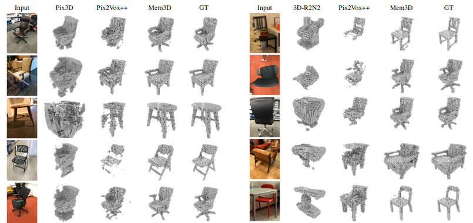

# Single-View 3D Object Reconstruction from Shape Priors in Memory

# 1. Introduction

The paper “Single-View 3D Object Reconstruction from Shape Priors in Memory” was published at the CVPR conference in 2021. The purpose of paper is to construct a three-dimensional model of an object with the help of a single-view. My goal was to create and train the network correctly. Unfortunately, due to processing power, time, and poorly understood parts of the paper, I could not reach the result. I made some trainings by making some simplifications in the dataset and network structure. I will explain their cause and effect.

## 1.1. Paper summary

Networks that generally construct 3D objects from images cannot produce high-quality objects due to noisy backgrounds and occlusions. The network used in this paper, called Mem3D, has made progress in this field thanks to its architecture and rendered (R2N2) dataset.
Mem3D, like other networks, makes images more compact with the help of image encoder. Shape decoder is used in the creation of 3D objects. Thanks to its memory network, Mem3D extracts shape priors and uses these priors in the construction of the object. This memory network provides a great advantage in constructing the object, especially in images with excessive occlusion.
Mem3D is trained with the R2N2 dataset. This dataset contains only rendered images. This trained model has also been tested with the Pix3D dataset containing real images.

Mem3d_inff

# 2. The method and my interpretation

## 2.1. The original method

The Mem3D network described in the paper simply consists of 4 parts. It can be said that shape priors are determined in the network and 3D object is reconstructed by combining image features and shape priors.

### 2.1.1 Image encoder

The image encoder starts with the first three convolutional blocks of the ResNet-50 model ready. In this way, the incoming image is reduced to 512 layers and 28x28 dimensions. Then the ResNet is followed by three sets of 2D convolutional layers, batch normalization layers and ReLU. The kernel size of the convolutional layers is given as 3. In addition to these, after ReLu in the 2nd and 3rd layers, there is a maxpooling layer with a kernel size of 2. The channels of these convolutional layers are 512, 256 and 256 respectively.

### 2.1.2 Memory network

The memory network aims to explicitly construct the shape priors by storing the “image-voxel” pairs, which memorize the correspondence between the image features and the corresponding 3D shapes. To do this, it saves the data in the form of a memory. It maps key image features and value shape priors to each other. The process of writing new data to the memory network is only done during training because ground thruth data is only available in this process. In order for data to be written to the memory during training, the similarity between the key and the image features must be below a certain rate. The similarity rate is given below.

$$S_k(F,K_i) = \frac{F \cdot K_i}{|F||K_i|}$$

The similarity for the memory network values can be calculated from the following formula.

$$S_v(v,V_i)= 1-\frac{1}{r_{v}^3} \sum_{j=1}^{r_{v}^{3}} (V_i^j-v^j)^2   $$

The following equation can be used to update the network.

$$ n_1 = argmax(S_k(F,K_i)) $$

After the model is trained, the memory netwok is used only for read operations. Keys and image features with similarity above beta value are sent to LSTM Shape Encoder.

$$ V = \left[ V_n |S_k(F, K_{n_i}) > \beta \right] $$

### 2.1.3 LSTM shape encoder

The 3D shapes that the image feature is most similar to and saved in the memory network are sent to the LSTM Encoder. Here, we can say that it is length-variant data because the number of inputs depends on the number of similar objects. After all similar shapes are sent to LSTM, only one shape prior vector is output. Many-to-one LSTM architecture includes 1 hidden layer with 2048 neuron, so the length of the shape prior vector is 2048.

### Notes

An important point is that shape priors depend on image features. The data sent to the shape decoder in the last step is a combination of image features and shape priors. Shape is reconstructed from this data.

### 2.1.4 Shape decoder

It contains 5 transposed 3D convolutional layers. The first four layers have a kernel size of 4, a stride size of 2, and a padding of 1. All four of these layers contain the batch normalization layer and ReLu. Only the last layer has sigmoid activation layer. The number of channels of the convolution layers are 512, 128, 32, 8 and 1, respectively.

## 2.2. My interpretation 

In my own implementation, I tried to keep the structure pretty much the same. However, I can say that there is a lot of information that is not provided in the paper. The most difficult issue in this implementation process was the dataset problem. Although the R2N2 dataset, released in 2015, is a Shapenet dataset, it has not been maintained for a long time. For this reason, old dataset functions do not work. To solve this problem, I had to write the dataset functions myself.

### 2.2.1. Image Encoder

Image encoder architecture is implemented as stated in the same paper.

### 2.2.2. Memory network and LSTM shape encoder

These architectures were created to create a memory between image features and shape priors. However, I could not implement it because there is insufficient information about the training process in the paper and it cannot be used directly in PyTorch. While the tensor coming out of the image encoder is (256x4x4) in size, the memory values must be (32x32x32) in size. The use of a value of this size by the next LSTM makes the network unsolvable. In addition to these, a fully-connected network is used instead of a memory network to prove the concept of using image features and shape priors together in the network. Image encoder data is flattened and supplied to the fully-connected network. Shape priors, which are fully-connected layer output, are combined with image features and sent to the shape decoder.

### 2.2.3. Shape Decoder

It is used for reconstruction of objects. It is implemented as the same as in the paper.

# 3. Experiments and results

## 3.1. Experimental setup

The experiments in the paper are done with Shapenet R2N2 and Pix3D datasets. The R2N2 dataset used especially for training is approximately 15 GB. These datasets can be downloaded using the links provided below.

No information is shared about the hardware the model is trained on. However, important information about the implementation was shared. The training batch size is specified as 32. We know that the network is trained end-to-end with the help of Adam optimizer. Voxels must be expressed in binary form in order to be displayed. The threshold value for displaying voxels is 0.85.

The "intersection over union" evaluation metric was used to compare Mem3D with its competitors. This metric simply controls how many voxels we classify.

Iou_fig

## 3.2. Running the code

It might say that the most important issue for running the code is datasets. My own implementation of datasets is in X. Here, there is a need for a document where the paths of the items are shared for the dataset. You can find the necessary python notebook to provide this file in the repository. This notebook simply navigates through the dataset folders and writes the paths to a document and saves them.

I am sharing pyton notebooks with necessary information and results for my implementation to be seen and understood easily. You can easily follow the process and see my results.

## 3.3. Results

Mem3D is an end-to-end trained system. The reduction in loss throughout the entire training is shared as a result.

result_loss

In addition, the purpose of Mem3D is to reconstruct objects with a single image. To demonstrate this, I visualize the input image, the ground truth, and the output of my model.

result_1
result_2

# 4. Conclusion

The paper does not include information such as the minimum loss value reached by the model and the duration of the training. It makes sense that my implementation was worse in the evaluation metric because the model architecture was not fully implemented. However, we can say that the model is still trainable after the changes I made for the prof-of-concept. Because the loss value is constantly decreasing.

Since it is difficult to evaluate the results with the help of a metric, I visualized the results of my model and ground truths. We can see more concretely how the model we trained can reconstruct an object from a single image. It can be said that the results are good despite this short training period.

# 5. References

[1]Chang, A. X., Funkhouser, T., Guibas, L., Hanrahan, P., Huang, Q., Li, Z., … Yu, F. (2015). ShapeNet: An Information-Rich 3D Model Repository. ArXiv. Retrieved from https://www.semanticscholar.org/paper/ShapeNet%3A-An-Information-Rich-3D-Model-Repository-Chang-Funkhouser/9b686d76914befea66377ec79c1f9258d70ea7e3

[2]Choy, C. B., Xu, D., Gwak, J., Chen, K., & Savarese, S. (2016). 3D-R2N2: A Unified Approach for Single and Multi-view 3D Object Reconstruction. ArXiv:1604.00449 [Cs]. Retrieved from https://arxiv.org/abs/1604.00449

[3]Miller, A., Fisch, A., Dodge, J., Karimi, A.-H., Bordes, A., & Weston, J. (2016). Key-Value Memory Networks for Directly Reading Documents. ArXiv:1606.03126 [Cs]. Retrieved from https://arxiv.org/abs/1606.03126

[4]Weston, J., Chopra, S., & Bordes, A. (2015). Memory Networks. ArXiv:1410.3916 [Cs, Stat]. Retrieved from https://arxiv.org/abs/1410.3916

[5]Yang, S., Xu, M., Xie, H., Perry, S., & Xia, J. (2021). Single-View 3D Object Reconstruction from Shape Priors in Memory. ArXiv:2003.03711 [Cs]. Retrieved from https://arxiv.org/abs/2003.03711

# Contact

Mehmet Sahin, mesahin@metu.edu.tr,  METU-ROMER & METU-Mechanical Engineering Department
