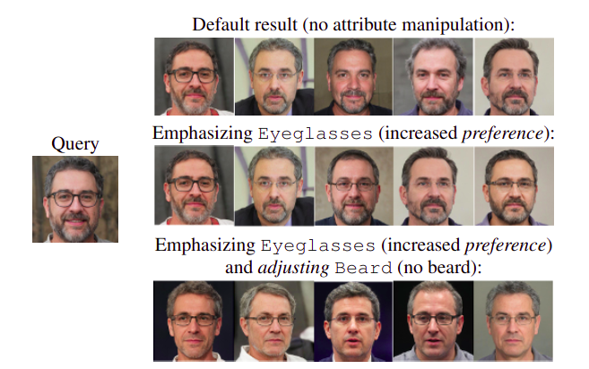
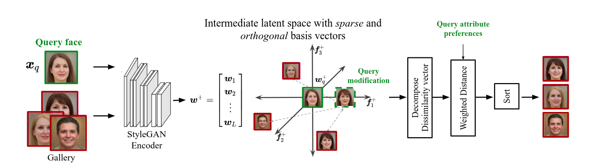
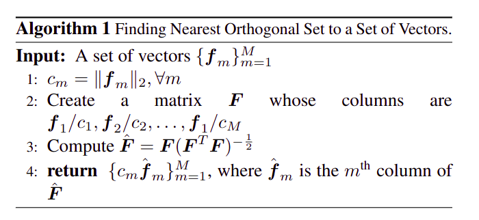
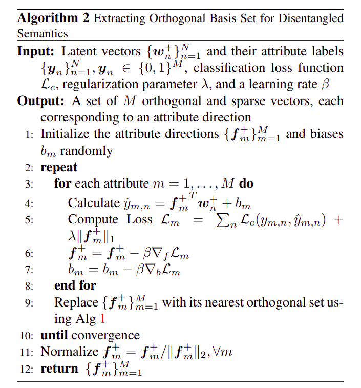

# Face Image Retrieval with Attribute Manipulation  
This readme file is an outcome of the [CENG501 (Spring 2022)](https://ceng.metu.edu.tr/~skalkan/DL/) project for reproducing a paper without an implementation. See [CENG501 (Spring 2022) Project List](https://github.com/CENG501-Projects/CENG501-Spring2022) for a complete list of all paper reproduction projects.  
  
# 1. Introduction  
This repository is an unofficial implementation of the paper "Face Image Retrieval with Attribute Manipulation" from ICCV 2021 [1]. In this repository, we provide the complete reproduction of the proposed methodology and some of its experimental results. Due to several parts in the paper that are not clear and stochastic choices, we did not obtain the same results reported in the paper.  
  
## 1.1. Paper summary  
The paper proposes a new formulation for the image search in the context of face image retrieval. Instead of a search in RGB domain, the query image is encoded onto the latent space of GANs. Then, the encoded image is augmented with adjustment and preference vectors. Finally, the augmented image is compared with images in the gallery set via attribute-weighted distance metric to retrieve most similar faces.  
  
The adjustment vector specifies the desired modifications to the facial attributes. For example, even though the query face has a beard attribute, by setting the corresponding entry in the adjustment vector, similar and beardless faces are retrieved.  
  
The preference vector assigns different levels of importance to the facial attributes. For example, retrieving faces with eyeglasses might be more important to the user. By increasing the preference value of eyeglasses attribute in the preference vector, the framework is more likely to retrieve similar faces with eyeglasses.  
  
The following figure from the paper demonstrates the effects of applying adjustment and preference vectors to the query face. The left image is the query face, whereas the images at the right are retrieved faces.  
  
<figure>  
      
    <figcaption style="text-align: center">Figure 1: The effects of adjustment and preference vectors on the retrieved images</figcaption>  
</figure>  
  
The authors encode the images onto the latent space of StyleGAN since it has been shown that different semantic attributes are fairly disentangled in the latent space of StyleGAN [2, 3]. Furthermore, they learn sparse and orthogonal attribute directions, i.e., basis set, in the latent space to further disentangle the attributes. While enforcing sparsity facilitates attribute adjustment, enforcing orthogonality facilitates attribute preference assignment and dissimilarity decomposition between query face and gallery faces.  
  
To sum up, the authors propose an attribute-guided face image retrieval framework whose most prominent feature is a method for learning sparse and orthogonal attribute directions in the latent space of StyleGAN, which further disentangles the semantic attributes and allows for simultaneous adjustment and preference assignment to attributes.  
  
The authors compare their work with a compositional learning method [4] and a GAN based method [5]. The former method does not allow for preference assignment to the attributes since it treats different semantics the same and cannot prioritize a subset of attributes. It uses adjustment text, which provides less flexibility compared to adjustment vector. And, it needs huge amount of labeled data to generate a semantically meaningful latent space and distance metric.   
  
The latter method applies attribute adjustments sequentially, which makes the results depend on the order of adjustment application. Furthermore, this sequential orthogonal projection complicates to define an attribute-guided distance metric and makes the image retrieval task very computationally expensive. The experimental results in the paper show that the proposed method achieves better retrieval performance than both methods.  

# 2. The method and my interpretation  
  
## 2.1. The original method  
The following figure from the paper captures the proposed face image retrieval framework.  
  
<figure>  
      
    <figcaption style="text-align: center">Figure 2: The overall architecture</figcaption>  
</figure>  
  
### 2.1.1. Encoding Images  
- For query images, learning the basis set, and as the gallery set the CelebA dataset [6] is used. Specifically, the test split is employed as the gallery set. Out of 160,000 images in the training split, 20,000 labeled images are selected for learning the basis set. Finally, 1,000 images from the gallery set is chosen as query images.  
- As a StyleGAN encoder which maps real images to latent vectors, pixel2style2pixel (pSp) [7] is used. The encoder produces 18 latent codes, each of which has 512 elements. These latent codes are concatenated to have a single column vector referred as latent vector ($w^+$). In the above figure, we see the latent vector is a concatenation of L latent codes.  
- A CelebA image has a label of 40 attributes, some of which are not related to faces and removed: Blurry, Necktie, Earrings, Hat, and Necklace. As a result, each label has M elements (i.e., M is 35).  
- A query consists of a query face image ($x_q$), adjustment vector ($a_q$), and preference vector ($p_q$). Both vectors have M elements. The entry in the adjustment vector can be between 0 and 1. Zero means the user do not want to obtain images with that attribute, and vice versa. The entry in the preference vector can be 0 or a positive real number. The higher the value, the more imporant the attribute. And, zero means that the user does not care about the presence/absence of that attribute.  
  
### 2.1.2. Learning Basis Set  
- Encoded training latent vectors and their labels are used to learn sparse and orthogonal basis set ($F$) in the latent space. The basis set consists of M attribute directions ($f_m^+$), each of which has $d^+$ elements, where $d^+$ is the size of a latent vector ($w^+$).  
- Learning a basis set is simply learning M hyperplanes in the latent space (Algorithm 2). To enforce sparsity condition $l_1$ regularization is used. And, to enforce orthogonality condition, Algorithm 1 is applied after each iteration, which finds the nearest orthonormal matrix to a given matrix.  
- The hinge loss is used as a classification loss in Algorithm 2.  
  
<figure>  
      
    <figcaption style="text-align: center">Algorithm 1</figcaption>  
</figure>  
  
<figure>  
      
    <figcaption style="text-align: center">Algorithm 2</figcaption>  
</figure>  
  
### 2.1.3. Retrieval via Orthogonal Decomposition  
- Having learned the basis set, queries can be evaluated by decomposing the dissimilarity vector into its components, adjusting the attributes, assigning preferences, and computing the attribute-weighted distance.  
  1. dissimilarity vector ($w_q^+ - w^+$) is decomposed into its components by projecting the vector onto M attributes ($d_F$) and onto subspace that is not covered by M attribute ($d_I$).  
     - $d_F = F \cdot (w_q^+ - w^+)$  
     - $d_I = (I - F \cdot F^{T}) \cdot (w_q^+ - w^+)$ where $I$ is an identity matrix  
  2. adjusting the attributes: $d_F = F \cdot (w_q^+ + \alpha \cdot f_m^+ - w^+)$ where $\alpha$ is a scalar.  
     - adjusting the m-th attribute is simply moving the latent vector along $f_m^+$ attribute direction.  
     - Due to how $d_I$ is defined, $d_I$ is not affected by attribute adjustments.  
  3. preference assignment and distance computation: distance = $d_F^{T} \cdot P \cdot d_F + \lVert d_I \rVert_2^2$ where $P$ is a diagonal matrix whose diagonal entries are preference values.
- For a query, the above procedure is repeated with all images in the gallery set. Having obtained the distances, they are sorted in ascending order and top-k images are retrieved.  

## 2.2. My interpretation
- How images for learning the basis set are chosen from the training split of the CelebA dataset is not clearly explained. We randomly selected 20,000 images from the training split.
- In Algorithm 2, which method is employed to initialize the attribute directions is not given. We observed that a good initialization strategy greatly speeds up the convergence compared to random initialization. We used "Xavier" initialization.
- In Algorithm 2, the loss values are accumulated but not averaged. We averaged the loss values over the dataset since accumulating the loss explodes the gradients.
- In Algorithm 2, stopping criterion is not defined. To prevent overfitting, we employed early stopping on the validation loss. If the validation loss does not decrease for 500 epochs, the training stops.
- the pSp encoder expects real images to be aligned. However, the paper does not comment on whether CelebA images are aligned or not. We chose to align images via "pixel2style2pixel/scripts/align_all_parallel.py" as aligned images achieve better training and validation losses in Algorithm 2.
- In quantitative experiments, which attribute is adjusted is not provided. We decided to adjust the 'Smiling' attribute and achieve experimental results for that attribute. 
  
# 3. Experiments and results  
  
## 3.1. Experimental setup
In the paper, the learning rate in Algorithm 2 is set to 1e-2. However, we find that using learning rates of 1e-2 or 1e-3 cause oscillations during the training. Please check "logs/train_log1.txt" and "logs/train_log2.txt" for the corresponding training histories. However, we observed that learning rate of 1e-4 greatly decreases the oscillations. Please check "logs/train_log3.txt". Hence, we use learning rate of 1e-4 in Algorithm 2.

Also, regularization parameter is set to 5e-3 by the authors. We run Algorithm 2 with the following regularization parameters: {1e-2, 5e-3, 1e-3, 0}. And, we found that best validation loss is achieved with regularization parameter of 0. Please check "logs/train_log3,4,5,6.txt" files.

As explained in Section 2.2, the authors did not state which attribute is adjusted to evaluate the performance metrics. Hence, we went with the "Smiling" attribute. 
  
## 3.2. Running the code

### 3.2.1. Environment
- Python 3.9
- Framework: PyTorch 1.12 - CUDA 11.3
- Libraries: Matplotlib, Ninja (for creating binding between Python and .cu files), and Dlib (for aligning the images).
- Tools: g++ 9.4, CUDA Toolkit 11.3 with cuDNN 8.2

### 3.2.2. Folder Structure
- figs: contains the figures used in the README.md file.
- logs: contains the training histories of Algorithm 2.
- datasets: should contain your CelebA dataset.
- pixel2style2pixel: should contain a clone of the [official pSp repository](https://github.com/eladrich/pixel2style2pixel).
- utils: contains the main code.
- weights: should contain serialized tensors such as learned basis set.

### 3.2.3. Running the Code
1. Run utils.functions.generate_latent_vectors() to generate latent vectors from CelebA images.
2. Run utils.functions.extract_orthogonal_basis_set() to learn the basis set.
3. Run utils.functions.compute_nDCG() to compute nDCG averaged over multiple queries.
-  Run utils.functions.compute_distance() to retrieve most similar images to a query.  
-  Run utils.peak.py for a sample qualitative analysis
## 3.3. Results  
Experiments in the paper can be divided into two categories: qualitative and quantitative experiments.  
Due to time and computational limitations, we evaluated the queries with the nDCG metric (not with the Identity Similarity metric).

### 3.3.1. Reported Results

Table 1: Top-5 images are retrieved.

| Preference Assignment | nDCG  | Identity Similarity | 
|-----------------------|-------|---------------------|
| No Preference         | 0.595 | 0.849               |
| Identity Constrained  | 0.858 | 0.864               |
| Best nDCG             | 0.923 | 0.848               |

Table 2: Top-10 images are retrieved.

| Preference Assignment | nDCG  | Identity Similarity | 
|-----------------------|-------|---------------------|
| No Preference         | 0.586 | 0.845               |
| Identity Constrained  | 0.847 | 0.855               |
| Best nDCG             | 0.917 | 0.827               |

Table 3: Top-20 images are retrieved.

| Preference Assignment | nDCG  | Identity Similarity | 
|-----------------------|-------|---------------------|
| No Preference         | 0.583 | 0.841               |
| Identity Constrained  | 0.835 | 0.846               |
| Best nDCG             | 0.909 | 0.833               |

### 3.3.2. Our Results

Table 4: Top-5 images are retrieved.

| Preference Assignment | nDCG  | Identity Similarity | 
|-----------------------|-------|---------------------|
| No Preference         | 0.513 | NA                  |
| Identity Constrained  | 0.778 | NA                  |
| Best nDCG             | 0.841 | NA                  |

Table 5: Top-10 images are retrieved.

| Preference Assignment | nDCG  | Identity Similarity | 
|-----------------------|-------|---------------------|
| No Preference         | 0.501 | NA                  |
| Identity Constrained  | 0.765 | NA                  |
| Best nDCG             | 0.832 | NA                  |

Table 6: Top-20 images are retrieved.

| Preference Assignment | nDCG  | Identity Similarity | 
|-----------------------|-------|---------------------|
| No Preference         | 0.495 | NA                  |
| Identity Constrained  | 0.746 | NA                  |
| Best nDCG             | 0.824 | NA                  |

# 4. Conclusion  
Looking at the reported and our results, we performed worse. The basis set achieving the best validation loss is trained with zero regularization in Algorithm 2. Since $l_1$ regularization enforces sparsity among the attribute directions, not regularizing the basis set harms sparsity and attribute adjustment. 
In our case, the attributes are not disentangled enough, and adjusting an attribute modifies multiple attributes at the same time. As a result, the augmented query retrieves non-related images and decreases the overall nDCG.

# 5. References  
[1] Zaeemzadeh et al., Face Image Retrieval with Attribute Manipulation,
    In Proceedings of the IEEE/CVF International Conference on Computer Vision (ICCV), 2021
    ([link](https://openaccess.thecvf.com/content/ICCV2021/html/Zaeemzadeh_Face_Image_Retrieval_With_Attribute_Manipulation_ICCV_2021_paper.html)).  
  
[2] Karras et al.,
    Analyzing and Improving the Image Quality of StyleGAN,
    In Proceedings of the IEEE Computer Society Conference on Computer Vision and Pattern Recoginition, 2020
    ([link](https://openaccess.thecvf.com/content_CVPR_2020/papers/Karras_Analyzing_and_Improving_the_Image_Quality_of_StyleGAN_CVPR_2020_paper.pdf)).  
  
[3] Karras et al.,
    A Style-based Generator Architecture for Generative Adversarial Networks,
    In Proceedings of the IEEE Computer Society Conference on Computer Vision and Pattern Recoginition, 2019
    ([link](https://openaccess.thecvf.com/content_CVPR_2019/papers/Karras_A_Style-Based_Generator_Architecture_for_Generative_Adversarial_Networks_CVPR_2019_paper.pdf)).  
  
[4] Vo et al.,
    Composing Text and Image for Image Retrieval - An Empirical Odyssey,
    In Proceedings of the IEEE Computer Society Conference on Computer Vision and Pattern Recognition, 2019
    ([link](https://openaccess.thecvf.com/content_CVPR_2019/papers/Vo_Composing_Text_and_Image_for_Image_Retrieval_-_an_Empirical_CVPR_2019_paper.pdf)).  
  
  
[5] Shen et al.,
    Interpreting the Latent Space of GANs for Semantic Face Editing,
    In Proceedings of the IEEE Computer Society Conference on Computer Vision and Pattern Recognition, 2020
    ([link](https://openaccess.thecvf.com/content_CVPR_2020/papers/Shen_Interpreting_the_Latent_Space_of_GANs_for_Semantic_Face_Editing_CVPR_2020_paper.pdf)).  

[6] Liu et al.,
    Deep Learning Face Attributes in the Wild,
    In Proceedings of the IEEE International Conference on Computer Vision, 2015
    ([link](https://openaccess.thecvf.com/content_iccv_2015/papers/Liu_Deep_Learning_Face_ICCV_2015_paper.pdf)).

[7] Richardson et al.,
    Encoding in Style: a StyleGAN Encoder for Image-to-Image Translation,
    In Proceedings of the IEEE Computer Society Conference on Computer Vision and Pattern Recoginition, 2021
    ([link](https://openaccess.thecvf.com/content/CVPR2021/papers/Richardson_Encoding_in_Style_A_StyleGAN_Encoder_for_Image-to-Image_Translation_CVPR_2021_paper.pdf)).
  
# Contact  
Muhammed Yasin Ulaş - [myulas@proton.me](mailto:myulas@proton.me)
